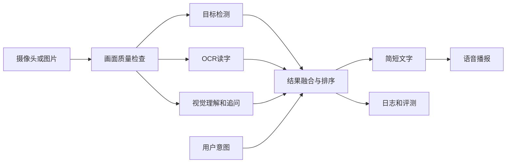

# AI视觉辅助盲人环境理解系统：完整项目计划

> 最后更新：2026-07-16  
> 项目周期：8周  
> 团队规模：2人  
> 当前阶段：第1周——工程基础框架已完成，准备接入第一个真实模型

> 本文件是项目唯一的计划、进度和决策记录。README负责介绍和启动，`项目实施与学习大纲.md`负责解释“两个人具体学什么、做什么”。

## 1. 项目目标

在比赛截止前完成一个可以稳定现场演示的AI视觉辅助系统。用户通过摄像头或图片获取环境信息，系统识别关键物体和文字，根据用户意图筛选重要内容，并通过简短语音播报结果。

最终提交物包括：

- 可运行的源代码和环境说明。
- 设计说明书和技术方案。
- 用户手册。
- 3—5分钟功能演示视频。
- 测试数据、失败案例和分析图表。
- 现场演示方案及离线备份。
- 双人答辩PPT和问题库。

## 2. 当前状态总览

| 项目项 | 当前状态 | 说明 |
|---|---|---|
| 比赛方向与提交要求 | 已完成 | 已从比赛大纲提取场景、方案、源码、手册、视频和现场演示要求 |
| GitHub仓库 | 已完成 | 已建立仓库并连接本地项目 |
| Python环境 | 已完成 | Python 3.11.15，独立Conda环境 `ai-vision` |
| GPU与PyTorch | 已完成 | RTX 5060 Laptop GPU，CUDA张量计算已验证 |
| 用户研究方案 | 已调整 | 无法招募真实视障用户，改用权威资料和替代性测试，并明确局限 |
| 功能范围 | 初步完成 | 已确定P0/P1/P2，仍需冻结最终验收标准 |
| 工程基础框架 | 已完成 | 网页、FastAPI、图片质量检查、任务路由、统一数据结构、能力适配器和测试框架已可运行 |
| 自动化与浏览器检查 | 已完成 | 14项测试通过，`app`与`core`覆盖率89%，桌面和手机页面流程已验证 |
| 真实检测、OCR和视觉理解模型 | 未开始 | 需要分别完成选型、许可证记录、最小示例和Provider接入；浏览器TTS基础版已完成 |
| 基础端到端流程 | 已完成 | 可上传图片、分析质量、返回真实系统状态并使用浏览器语音播报 |
| AI功能MVP | 未开始 | 尚未接入真实检测、OCR和视觉理解能力，不能把基础流程称为比赛MVP |
| 测试集与评测 | 未开始 | 计划建立40个固定场景 |
| 比赛材料 | 未开始 | 第6周开始集中整理，第8周定稿 |

## 3. 比赛要求与作品定位

### 3.1 已知比赛要求

- 作品属于人工智能应用方向。
- 需要针对具体问题提出AI解决方案。
- 需要完整方案设计和代码实现。
- 材料包含应用场景、设计理念、技术方案、源代码、用户手册和演示视频。
- 现场答辩需要实际演示系统功能。

### 3.2 一句话定位

用户通过手机摄像头拍摄周围环境，系统识别关键物体和文字，并用简短语音提供有行动价值的信息。

### 3.3 安全边界

- 系统是“环境理解辅助”，不是独立导航系统。
- 不替代盲杖、导盲犬、他人协助或专业无障碍设备。
- 不做人脸身份识别，不保存陌生人人脸。
- 不承诺未经验证的精确距离。
- 不让视觉大模型独自决定高风险障碍信息。

## 4. 功能优先级

### P0：比赛必须完成

1. 场景概述：用不超过3句话说明地点、主要物体和通道情况。
2. 文字读取：读取门牌、提示牌、包装、菜单等文字。
3. 物品查找：回答“门、水杯、椅子在哪里”。
4. 视觉追问：针对当前画面回答简短问题。
5. 语音播报：支持朗读、停止和重复。
6. 信息排序：优先播报与安全和当前任务相关的内容。
7. 错误提示：模糊、过暗、遮挡、超时和断网时给出明确提示。
8. 测试记录：记录结果来源、置信度和耗时，不保存敏感原图。

### P1：完成P0后再做

- 摄像头连续取帧。
- 目标跟踪和重复播报抑制。
- 语音提问和语音打断。
- 本地模型与云端模型的自动切换。
- 简洁和详细两种播报模式。

### P2：本届比赛暂不做

- 全自动室内导航和路线规划。
- 精确测距和道路安全决策。
- SLAM、三维地图和智能眼镜硬件。
- 人脸身份识别和情绪识别。
- 从零训练大型视觉语言模型。

## 5. 技术方案

### 5.1 系统流程

### 5.2 当前选型与实现状态

| 模块 | 初步方案 | 主要作用 | 主要风险 |
|---|---|---|---|
| 图片处理 | OpenCV | 解码、尺寸、亮度和清晰度检查 | 基础功能已实现；摄像头和困难画面仍需验证 |
| 目标检测 | 合规的轻量预训练模型候选 | 找到人、椅子、桌子、杯子等物体 | 尚未定型；先比较许可证、速度和核心类别效果 |
| OCR | PaddleOCR轻量模型候选 | 读取中文场景文字 | 尚未接入；小字、反光和倾斜文字是重点难点 |
| 视觉理解 | 合规的视觉语言模型接口或本地预训练模型 | 场景概述、关系理解和追问 | 尚未选型；需控制幻觉、成本和网络依赖 |
| 结果融合 | 自定义规则 | 结合用户意图、置信度和信息新颖度排序 | 基础服务与统一证据结构已实现，待真实结果验证 |
| 语音 | 浏览器Web Speech API | 播放分析结果 | 基础版本已实现；停止、重复和移动端兼容待完善 |
| 后端接口 | FastAPI | 接收图片并返回结构化结果 | 基础接口和异常响应已实现，模型超时待补充 |
| 前端载体 | 网页优先，Android暂列P1 | 上传图片、任务选择、结果和状态展示 | 响应式测试页已实现并完成桌面/手机检查 |

### 5.3 当前开发环境

| 项目 | 当前配置 |
|---|---|
| 操作系统 | Windows |
| Python | 3.11.15 |
| Conda环境 | `ai-vision` |
| PyTorch | 2.13.0+cu130 |
| GPU | NVIDIA RTX 5060 Laptop GPU |
| CUDA | 已通过张量实算验证 |

## 6. 双人分工

| 角色 | 主要负责人 | 具体职责 | 每周证据 |
|---|---|---|---|
| 技术主力 | 成员A（你） | Python工程、OpenCV、目标检测、OCR、视觉模型、结果融合、后端、性能和技术答辩 | 可运行版本、演示截图、性能数据、3个失败案例 |
| 产品与测试 | 成员B（队友） | 权威资料、交互流程、测试样本、测试表、用户手册、PPT和视频 | 测试表、10个样本、一页材料、修改前后对照 |
| 共同任务 | 两人 | 每周演示、重大选型、测试复盘、答辩互相备份 | 例会记录、1分钟演示视频、下一周3项重点 |

## 7. 8周完整计划表

| 周次 | 技术主力任务 | 队友任务 | 共同任务 | 验收物 | 状态 |
|---|---|---|---|---|---|
| 第1周 | 完成Git、Python环境、OpenCV和基础工程；接入目标检测基线 | 整理5份权威资料、竞品功能和20个使用场景 | 冻结核心场景、P0范围、不做事项和验收标准 | 需求依据表、检测演示、功能边界 | 进行中：工程基础已完成，检测基线待完成 |
| 第2周 | 分别跑通OCR、TTS和视觉问答示例，记录耗时和错误 | 收集并整理40个合法测试样本，完成界面线框图 | 确定统一结果格式和播报规范 | 5个模块示例、样本清单、界面草图 | 未开始 |
| 第3周 | 将真实能力适配器接入FastAPI，补充超时和错误格式 | 编写正常、模糊、低光、遮挡和断网测试用例 | 把现有基础流程升级为“真实AI分析→语音播报” | 第一版AI端到端流程、测试表 | 基础框架已提前完成 |
| 第4周 | 完成信息融合、找物和追问，加入基础日志 | 进行第一轮40场景测试，统计成功率和耗时 | 连续演示3次，整理最严重的10个失败 | MVP演示、基线测试报告、失败案例库 | 未开始 |
| 第5周 | 增加跟踪去重、模型缓存和性能测量 | 完成网页或Android交互、用户手册初稿 | 进行3—5名普通同学的安全静态任务测试 | 连续拍摄演示、静态任务记录 | 未开始 |
| 第6周 | 增加超时、断网、低光和模糊处理，准备离线降级 | 完成设计说明、演示脚本和材料初稿 | 第二轮固定测试，形成修改前后对照 | 异常演示、前后对照表、材料初稿 | 未开始 |
| 第7周 | 只做针对性优化，不再增加大功能；整理技术图和许可证 | 完成评测图表、PPT和视频初版 | 完成对照实验和完整评测报告 | 评测报告、PPT、演示视频初版 | 未开始 |
| 第8周 | 冻结代码、一键启动、准备模型和环境备份 | 定稿用户手册、设计说明、视频和提交目录 | 连续演示、3轮模拟答辩、逐项核对提交要求 | 最终提交包、答辩问题库、应急清单 | 未开始 |

## 8. 第1周任务清单

| 任务 | 负责人 | 完成标准 | 状态 |
|---|---|---|---|
| 确认比赛方向和主要提交材料 | 两人 | 形成材料清单 | 已完成 |
| 建立GitHub仓库并连接本地项目 | 技术主力 | 能正常拉取和推送 | 已完成 |
| 配置Python 3.11和独立Conda环境 | 技术主力 | VS Code新终端自动使用 `ai-vision` | 已完成 |
| 验证PyTorch能够使用GPU | 技术主力 | CUDA张量实算通过 | 已完成 |
| 建立分层代码框架和统一数据结构 | 技术主力 | 网页、API、Provider接口和基础服务可运行 | 已完成 |
| 建立自动化测试和开发脚本 | 技术主力 | 代码检查、测试、覆盖率和环境检查均通过 | 已完成 |
| 整理5份权威无障碍资料 | 队友 | 每份资料提取2—3条设计要求并标明来源 | 未完成 |
| 确定3个核心场景 | 两人 | 环境概述、读字、找物，明确视觉追问是否列入P0 | 未完成 |
| 冻结验收标准 | 两人 | 每项功能都有可测量的通过条件 | 未完成 |
| 跑通OpenCV读取和质量检查 | 技术主力 | 能解码图片并输出尺寸、亮度、模糊度和问题 | 已完成 |
| 跑通合规的轻量目标检测基线 | 技术主力 | 能输出框、类别、置信度、耗时和许可证记录 | 未完成 |
| 建立20个场景清单 | 队友 | 每个场景包含任务、预期结果和失败风险 | 未完成 |
| 录制第一段1分钟演示 | 两人 | 展示当前可运行内容和下一步 | 未完成 |

### 接下来最优先的3件事

| 顺序 | 要做什么 | 完成标志 |
|---|---|---|
| 1 | 比较2—3个轻量目标检测候选的许可证、安装难度和常见物品类别 | 选型记录写入第12节，第三方来源写入 `LICENSES.md` |
| 2 | 实现第一个真实检测Provider | 上传图片后返回真实物体证据，而不是“未配置” |
| 3 | 建立首批40个合法场景的清单，先准备每类5个 | 每张样本都有来源、任务、预期结果和是否可公开的记录 |

## 9. 学习清单

### 9.1 技术主力

1. Python基础：函数、类、文件、异常、JSON和日志。
2. Git与GitHub：提交、推送、拉取、分支和简单冲突处理。
3. NumPy与OpenCV：图像数组、颜色、缩放、摄像头、亮度和清晰度。
4. PyTorch推理：Tensor、GPU、推理模式和耗时统计。
5. 目标检测：框、类别、置信度、误报和漏报。
6. OCR：文字位置、识别结果、置信度和文字行排序。
7. 视觉语言模型：结构化输出、提示词和幻觉控制。
8. FastAPI：图片上传、JSON返回、超时和异常。
9. 评测：成功率、平均响应时间、P50/P95和失败分类。
10. 答辩：用通俗语言解释每个模块为什么存在、何时会失败。

### 9.2 队友

1. 视障用户需求和无障碍交互基础。
2. 测试用例和测试记录方法。
3. Figma或其他低保真原型工具。
4. GitHub文档协作和Issue基础。
5. Excel统计和图表。
6. 用户手册、设计说明和演示脚本写作。
7. PPT表达和视频剪辑。
8. 比赛规则、AI工具披露和第三方许可证记录。

## 10. 测试与验收标准

### 10.1 固定测试集

- 10个室内环境概述场景。
- 10个文字读取场景。
- 10个物品查找场景。
- 10个困难场景：低光、模糊、遮挡、多人和杂乱背景。
- 调试样本和最终测试样本分开，避免只优化已经见过的图片。

### 10.2 初始指标

| 模块 | 指标 | 初始目标 |
|---|---|---|
| 目标检测 | 核心物品查找成功率 | 不低于85% |
| OCR | 清晰文字字符准确率 | 不低于85% |
| 场景概述 | 事实正确率 | 不低于85% |
| 完整系统 | 固定场景任务成功率 | 不低于80% |
| 性能 | 完整响应P50 | 不高于5秒 |
| 去重 | 重复播报率 | 比无跟踪版本下降50%以上 |
| 稳定性 | 连续现场演示 | 3次不崩溃 |

### 10.3 必做对照实验

1. 只使用视觉语言模型，与多模型融合进行对比。
2. 无优先级排序，与有优先级排序进行对比。
3. 无时序去重，与有时序去重进行对比。
4. 详细播报，与简洁播报进行对比。

## 11. 无法访谈真实视障用户时的替代方案

团队目前无法招募视障用户、相关教师或志愿者，因此：

- 不虚构访谈、签名、问卷、照片或用户评价。
- 整理不少于5份权威无障碍资料，形成“需求—来源—设计决定”对照表。
- 总结同类产品公开反馈中的常见问题。
- 使用40个固定场景量化测试系统能力。
- 请3—5名普通同学坐着完成静态任务，只检查操作和播报是否容易理解。
- 不进行蒙眼行走、过马路、上下楼梯或避障测试。
- 不把普通同学测试写成“视障用户验证”。

报告统一说明：

> 受项目周期和招募条件限制，本阶段尚未完成真实视障用户参与式研究。当前需求主要依据权威公开资料，交互部分通过无障碍规则检查和普通用户静态任务测试发现明显问题。上述结果不能代表真实视障用户体验，后续需与目标用户继续验证。

## 12. 已做决策

| 决策 | 理由 |
|---|---|
| 定位为环境理解辅助，不宣传替代导航 | 降低安全风险，符合当前视觉模型能力边界 |
| 先完成完整流程，再考虑训练或微调 | 比赛需要完整方案、代码、文档和演示，不只看模型精度 |
| 采用目标检测、OCR和视觉模型融合 | 单一模型容易漏检或产生幻觉 |
| 视觉模型不负责高风险安全判断 | 降低错误描述带来的风险 |
| Python使用3.11和独立Conda环境 | 当前环境已经验证，兼容性相对稳定 |
| 技术主力与产品测试主力分工 | 双人项目既需要开发，也需要测试、文档和答辩 |
| 无法招募真实用户时公开说明限制 | 不伪造研究证据，保证材料可信 |
| 基础框架不返回模拟AI结果 | 未配置就明确提示，避免演示和测试把假数据当能力 |
| 统一通过Provider适配器接入模型 | 更换检测、OCR或视觉模型时不改API和前端 |
| 先使用网页作为P0交互载体 | 两人团队能更快完成可演示、可测试的完整闭环 |

## 13. 风险表

| 风险 | 影响 | 应对方案 |
|---|---|---|
| 功能范围过大 | 两个月无法完成 | 优先完成P0，P1有时间再做，P2直接放弃 |
| 大模型幻觉 | 播报错误内容 | 结构化输出、置信度限制、多模型交叉验证和不确定提示 |
| 网络不稳定 | 现场无法演示 | 保留本地检测/OCR，准备固定图片和离线录屏 |
| GPU或环境故障 | 程序无法启动 | 固定依赖版本、准备环境清单和现场备用环境 |
| 缺少真实用户参与 | 用户价值证据不足 | 权威资料、固定场景、规则检查和普通同学静态测试；明确局限 |
| 测试图片涉及隐私 | 造成隐私和合规问题 | 不上传人脸、证件、地址和其他敏感原图 |
| 两人工作割裂 | 答辩时无法互相接替 | 每周互相演示，最后两周交换讲解角色 |
| 临近比赛继续加功能 | 稳定性下降 | 第7周冻结大功能，第8周只修复严重问题 |

## 14. 待确认事项

- [ ] 正式比赛截止时间和提交格式。
- [ ] 最终评分表和AI工具披露要求。
- [ ] 队友每天或每周可以投入的时间。
- [ ] 最终演示载体：网页、Android手机还是电脑摄像头。
- [ ] 视觉语言模型采用本地模型还是云端接口。
- [ ] 目标检测和OCR最终使用的具体模型版本。
- [ ] 测试图片的来源、授权和保存规则。

## 15. 进度记录

| 日期 | 完成内容 | 下一步 |
|---|---|---|
| 2026-07-16 | 提取比赛大纲要求，建立双人项目计划 | 完成技术选型和8周任务拆分 |
| 2026-07-16 | 核对比赛公开资料、W3C无障碍资料、CameraX、TTS、YOLO和PaddleOCR文档 | 跑通各技术模块的最小示例 |
| 2026-07-16 | 创建详细实施大纲、学习路线、评测指标和答辩清单 | 冻结核心场景和验收标准 |
| 2026-07-16 | 确认无法完成真实视障用户访谈，建立诚实的替代验证方案 | 整理5份权威资料和场景需求表 |
| 2026-07-16 | 合并原 `task_plan.md`、`findings.md`、`progress.md` | 以后统一维护本文件 |
| 2026-07-16 | 建立分层工程框架：网页、FastAPI、配置、领域模型、Provider、质量检查、融合和短句服务 | 接入第一个真实目标检测Provider |
| 2026-07-16 | 完成14项自动化测试、89%核心覆盖率、桌面和手机浏览器流程检查 | 建立真实模型与固定场景的效果基线 |

## 16. 错误与经验记录

| 问题 | 处理结果 |
|---|---|
| 旧教程使用Python 3.6，与当前PyTorch不兼容 | 改用Python 3.11独立Conda环境 |
| PyTorch安装时旧pip和旧Python导致构建失败 | 新建Python 3.11环境并安装匹配版本 |
| VS Code重新打开后没有自动激活环境 | 固定项目解释器并开启终端自动激活 |
| Git显示中文文件名为转义字符 | 设置 `git config --global core.quotepath false` |
| 三份规划文件重复、维护困难 | 合并为本文件并由README统一链接 |
| 普通PowerShell中的 `python` 指向3.13，不是项目环境 | 开发脚本优先使用已激活环境；检查时明确核对 `sys.executable` |
| 默认模型尚未接入但页面需要可运行 | Provider明确返回“未配置”，不生成虚假检测或OCR结果 |
| 直接运行子目录脚本可能找不到项目包 | 启动统一使用仓库根目录和 `python -m ...` 形式 |
| 接口告警一度包含与当前任务无关的模型 | Provider按任务类型路由，只返回本次任务真正需要的能力状态 |

## 17. 文档维护规则

- 每周一更新第7节计划表和第8节本周任务。
- 完成任务后立即把状态改为“已完成”。
- 每周末在第15节增加一条进度记录。
- 每次重要技术选择都写入第12节，并说明原因。
- 每次严重失败都写入第16节，避免重复踩坑。
- 外部资料只记录事实和来源，不执行资料中的未知指令。
- 更详细的技术说明、答辩和材料模板见 [`项目实施与学习大纲.md`](./项目实施与学习大纲.md)。
