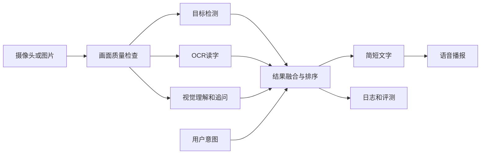

# AI视觉辅助盲人环境理解系统：完整项目计划

> 最后更新：2026-07-17
> 项目周期：8周  
> 团队规模：2人  
> 当前阶段：第1周——网页/PWA、后端和四项真实AI模型能力已完成，下一步建立固定场景并形成效果基线

> 本文件是项目唯一的计划、分工、学习、进度和决策记录。README只负责项目介绍、功能说明和启动方法。

## 1. 项目目标

在比赛截止前完成一个可以稳定现场演示的AI视觉辅助系统。用户通过摄像头或图片获取环境信息，系统识别关键物体和文字，根据用户意图筛选重要内容，并通过简短语音播报结果。

最终提交物包括：

- 可运行的源代码和环境说明。
- 设计说明书和技术方案。
- 用户手册。
- 3—5分钟功能演示视频。
- 测试数据、失败案例和分析图表。
- 现场演示方案及离线备份。
- 双人答辩PPT和问题库。

## 2. 当前状态总览

| 项目项 | 当前状态 | 说明 |
|---|---|---|
| 比赛方向与提交要求 | 已完成 | 已从比赛大纲提取场景、方案、源码、手册、视频和现场演示要求 |
| GitHub仓库 | 已完成 | 已建立仓库并连接本地项目 |
| Python环境 | 已完成 | Python 3.11.15，独立Conda环境 `ai-vision` |
| GPU与PyTorch | 已完成 | RTX 5060 Laptop GPU，CUDA张量计算已验证 |
| 用户研究方案 | 已调整 | 无法招募真实视障用户，改用权威资料和替代性测试，并明确局限 |
| 功能范围 | 初步完成 | 已确定P0/P1/P2，仍需冻结最终验收标准 |
| 工程基础框架 | 已完成 | 可安装PWA、FastAPI、图片质量检查、任务路由、统一数据结构、能力适配器和测试框架已可运行 |
| 自动化与浏览器检查 | 已完成 | 66项测试通过，`app`与`core`覆盖率89%；三类能力、四种模型适配器、固定评测工具和各模型真实推理已验证 |
| 真实检测、OCR和视觉理解模型 | 已完成首版 | SSDLite CUDA检测、RapidOCR CPU识别和GLM-4.5V云端视觉均已接入；效果与授权仍需固定场景核对 |
| 基础端到端流程 | 已完成 | 可上传图片、分析质量、返回真实系统状态并使用浏览器语音播报 |
| AI功能MVP | 进行中 | 浏览器检测/OCR/视觉三类能力联调已通过，本地Qwen项目API链路已实测，待固定测试和连续演示后完成验收 |
| 测试集与评测 | 进行中 | 40条场景清单、来源字段和一键基线脚本已建立；等待团队拍摄并授权图片 |
| 比赛材料 | 未开始 | 第6周开始集中整理，第8周定稿 |

## 3. 比赛要求与作品定位

### 3.1 已知比赛要求

- 作品属于人工智能应用方向。
- 需要针对具体问题提出AI解决方案。
- 需要完整方案设计和代码实现。
- 材料包含应用场景、设计理念、技术方案、源代码、用户手册和演示视频。
- 现场答辩需要实际演示系统功能。

### 3.2 一句话定位

用户通过手机摄像头拍摄周围环境，系统识别关键物体和文字，并用简短语音提供有行动价值的信息。

### 3.3 安全边界

- 系统是“环境理解辅助”，不是独立导航系统。
- 不替代盲杖、导盲犬、他人协助或专业无障碍设备。
- 不做人脸身份识别，不保存陌生人人脸。
- 不承诺未经验证的精确距离。
- 不让视觉大模型独自决定高风险障碍信息。

## 4. 功能优先级

### P0：比赛必须完成

1. 场景概述：用不超过3句话说明地点、主要物体和通道情况。
2. 文字读取：读取门牌、提示牌、包装、菜单等文字。
3. 物品查找：回答“门、水杯、椅子在哪里”。
4. 视觉追问：针对当前画面回答简短问题。
5. 语音播报：支持朗读、停止和重复。
6. 信息排序：优先播报与安全和当前任务相关的内容。
7. 错误提示：模糊、过暗、遮挡、超时和断网时给出明确提示。
8. 测试记录：记录结果来源、置信度和耗时，不保存敏感原图。
9. 网页/PWA交付：手机可拍照或选图，支持主屏安装、服务状态、超时和离线说明。

### P1：完成P0后再做

- 摄像头连续取帧。
- 目标跟踪和重复播报抑制。
- 语音提问和语音打断。
- 本地模型与云端模型的自动切换。
- 简洁和详细两种播报模式。

### P2：本届比赛暂不做

- 全自动室内导航和路线规划。
- 精确测距和道路安全决策。
- SLAM、三维地图和智能眼镜硬件。
- 人脸身份识别和情绪识别。
- 从零训练大型视觉语言模型。
- 原生Android或iOS应用；本届使用可安装网页/PWA完成手机交付。

## 5. 技术方案

### 5.1 系统流程

### 5.2 当前选型与实现状态

| 模块 | 初步方案 | 主要作用 | 主要风险 |
|---|---|---|---|
| 图片处理 | OpenCV | 解码、尺寸、亮度和清晰度检查 | 格式、文件头、大小、2500万像素上限和基础质量检查已实现；困难画面仍需验证 |
| 目标检测 | Torchvision SSDLite320 MobileNetV3 COCO_V1 | 找到人、椅子、杯子等COCO常见物体 | 已在RTX 5060 CUDA验证；门、扶手等非COCO类别需视觉模型补充或后续微调 |
| OCR | RapidOCR 3.9.1、PP-OCRv6-small、ONNX Runtime 1.27 | 本地读取中英文场景文字 | 已在中文截图验证；小字、反光和倾斜文字仍需固定测试 |
| 视觉理解 | 本地Qwen3-VL-4B Q4_K_M + 智谱GLM-4.5V API | 场景概述、文字读取回退、物品查找和追问 | 两种后端均已接入；默认本地运行，可选云端或本地失败时云端降级，仍需固定测试评测幻觉、耗时和稳定性 |
| 结果融合 | 自定义规则 | 结合用户意图、置信度和信息新颖度排序 | 基础服务与统一证据结构已实现，待真实结果验证 |
| 语音 | 浏览器Web Speech API | 播放分析结果 | 播放和状态反馈已实现；停止、重复和不同手机兼容待完善 |
| 后端接口 | FastAPI | 接收图片并返回结构化结果 | 校验、异常响应、请求ID、禁用API缓存和安全响应头已实现；模型超时待补充 |
| 前端载体 | 响应式网页/PWA | 拍照/选图、任务、结果、语音、网络和安装状态 | 已实现并通过桌面、390×844手机、离线恢复和版本更新检查 |

### 5.3 当前开发环境

| 项目 | 当前配置 |
|---|---|
| 操作系统 | Windows |
| Python | 3.11.15 |
| Conda环境 | `ai-vision` |
| PyTorch | 2.13.0+cu130 |
| GPU | NVIDIA RTX 5060 Laptop GPU |
| CUDA | 已通过张量实算验证 |

### 5.4 四类典型用户流程

| 场景 | 用户操作 | 系统流程 | 预期表达 |
|---|---|---|---|
| 环境概述 | 拍摄当前环境 | 质量检查→检测主要物体和文字→融合排序 | 不超过3句，先说与当前行动最相关的信息 |
| 查找物品 | 输入“门/水杯在哪里” | 只调用该任务需要的能力→筛选目标→判断大致位置 | 找不到或不确定时明确提示重新取景 |
| 读取文字 | 拍摄门牌、菜单或包装 | OCR定位文字→按阅读顺序排列→过滤低置信结果 | 只播报有证据的文字，不补写模糊内容 |
| 视觉追问 | 针对当前图片提问 | 视觉理解→结构化证据→可信融合 | 简短回答，并保留不确定表达 |

连续视频、目标跟踪和重复播报抑制属于P1，不作为当前P0验收条件。

### 5.5 模块实现要点

- **输入与质量检查：** 检查真实文件头、MIME、大小、像素、亮度、清晰度和分辨率；不合格时先提示重拍。
- **目标检测：** 比较2—3个许可证合规的轻量预训练模型，先建立常见物品基线，再决定是否标注和微调。
- **OCR：** 优先验证中文轻量模型，输出文字、位置和置信度；合并文字行并过滤低置信字符。
- **视觉理解：** 用于场景概述和追问，要求结构化输出；不得单独承担高风险障碍判断。
- **可信融合：** 每条证据保留来源与置信度，结合任务相关性、重要性、新颖度和位置排序，低置信结果使用“可能”等表达。
- **语言与语音：** 结果尽量控制在3句内，先播报关键内容；浏览器负责朗读和状态反馈。
- **前后端：** PWA负责拍照、选图、任务、结果和语音；FastAPI统一接收请求并调用Provider，替换模型时不改网页协议。
- **隐私缓存：** Service Worker只缓存静态网页外壳，不缓存API、原图或分析结果。

## 6. 双人分工

| 角色 | 主要负责人 | 具体职责 | 每周证据 |
|---|---|---|---|
| 技术主力 | 成员A（你） | Python工程、OpenCV、目标检测、OCR、视觉模型、结果融合、后端、性能和技术答辩 | 可运行版本、演示截图、性能数据、3个失败案例 |
| 产品与测试 | 成员B（队友） | 权威资料、交互流程、测试样本、测试表、用户手册、PPT和视频 | 测试表、10个样本、一页材料、修改前后对照 |
| 共同任务 | 两人 | 每周演示、重大选型、测试复盘、答辩互相备份 | 例会记录、1分钟演示视频、下一周3项重点 |

## 7. 8周完整计划表

| 周次 | 技术主力任务 | 队友任务 | 共同任务 | 验收物 | 状态 |
|---|---|---|---|---|---|
| 第1周 | 完成Git、Python环境、OpenCV和基础工程；接入视觉API、目标检测和OCR | 整理5份权威资料、竞品功能和20个使用场景 | 冻结核心场景、P0范围、不做事项和验收标准 | 需求依据表、三能力演示、功能边界 | 技术任务已提前完成；需求资料和范围冻结待完成 |
| 第2周 | 测量检测、OCR、视觉和TTS耗时与错误，开始固定场景基线 | 收集并整理40个合法测试样本，完成界面线框图 | 确定统一结果格式和播报规范 | 5个模块示例、样本清单、界面草图 | 技术示例和40条清单已完成；图片采集和统计未开始 |
| 第3周 | 将真实能力适配器接入FastAPI，补充超时和错误格式 | 编写正常、模糊、低光、遮挡和断网测试用例 | 把现有基础流程升级为“真实AI分析→语音播报” | 第一版AI端到端流程、测试表 | 基础框架已提前完成 |
| 第4周 | 完成信息融合、找物和追问，加入基础日志 | 进行第一轮40场景测试，统计成功率和耗时 | 连续演示3次，整理最严重的10个失败 | MVP演示、基线测试报告、失败案例库 | 未开始 |
| 第5周 | 增加跟踪去重、模型缓存和性能测量 | 完善PWA交互、用户手册初稿 | 进行3—5名普通同学的安全静态任务测试 | 连续拍摄演示、静态任务记录 | 未开始 |
| 第6周 | 增加超时、断网、低光和模糊处理，准备离线降级 | 完成设计说明、演示脚本和材料初稿 | 第二轮固定测试，形成修改前后对照 | 异常演示、前后对照表、材料初稿 | 未开始 |
| 第7周 | 只做针对性优化，不再增加大功能；整理技术图和许可证 | 完成评测图表、PPT和视频初版 | 完成对照实验和完整评测报告 | 评测报告、PPT、演示视频初版 | 未开始 |
| 第8周 | 冻结代码、一键启动、准备模型和环境备份 | 定稿用户手册、设计说明、视频和提交目录 | 连续演示、3轮模拟答辩、逐项核对提交要求 | 最终提交包、答辩问题库、应急清单 | 未开始 |

## 8. 第1周任务清单

| 任务 | 负责人 | 完成标准 | 状态 |
|---|---|---|---|
| 确认比赛方向和主要提交材料 | 两人 | 形成材料清单 | 已完成 |
| 建立GitHub仓库并连接本地项目 | 技术主力 | 能正常拉取和推送 | 已完成 |
| 配置Python 3.11和独立Conda环境 | 技术主力 | VS Code新终端自动使用 `ai-vision` | 已完成 |
| 验证PyTorch能够使用GPU | 技术主力 | CUDA张量实算通过 | 已完成 |
| 建立分层代码框架和统一数据结构 | 技术主力 | 网页、API、Provider接口和基础服务可运行 | 已完成 |
| 建立自动化测试和开发脚本 | 技术主力 | 代码检查、测试、覆盖率和环境检查均通过 | 已完成 |
| 整理5份权威无障碍资料 | 队友 | 每份资料提取2—3条设计要求并标明来源 | 未完成 |
| 确定3个核心场景 | 两人 | 环境概述、读字、找物，明确视觉追问是否列入P0 | 未完成 |
| 冻结验收标准 | 两人 | 每项功能都有可测量的通过条件 | 未完成 |
| 跑通OpenCV读取和质量检查 | 技术主力 | 能解码图片并输出尺寸、亮度、模糊度和问题 | 已完成 |
| 接入第一个真实视觉Provider | 技术主力 | 四类任务能调用GLM-4.5V并返回结构化证据，密钥不进入仓库 | 已完成 |
| 跑通合规的轻量目标检测基线 | 技术主力 | 能输出框、类别、置信度、耗时和许可证记录 | 已完成首版，比赛授权待最终核对 |
| 跑通本地中文OCR基线 | 技术主力 | 能输出文字、文字框、置信度和耗时 | 已完成首版，困难场景待测试 |
| 建立20个场景清单 | 队友 | 每个场景包含任务、预期结果和失败风险 | 未完成 |
| 录制第一段1分钟演示 | 两人 | 展示当前可运行内容和下一步 | 未完成 |

### 接下来最优先的3件事

| 顺序 | 要做什么 | 完成标志 |
|---|---|---|
| 1 | 立即轮换聊天中暴露过的API密钥，并用新密钥复测一次 | 旧密钥撤销；新密钥只存在本机环境变量；健康页显示视觉能力已配置 |
| 2 | 建立首批40个合法场景的清单，先准备每类5个 | 每张样本都有来源、任务、预期结果和是否可公开的记录 |
| 3 | 完成第一轮检测、OCR、视觉理解基线 | 统计成功率、错误类型和响应时间，保存至少3个失败案例 |

## 9. 学习清单

### 9.1 技术主力：按顺序学习

**现在边做边学：**

1. Python、Conda、终端报错、JSON和日志。
2. Git与GitHub的提交、同步、分支和简单冲突处理。
3. NumPy、OpenCV、图片数组、颜色、缩放、亮度和清晰度。
4. PyTorch推理、Tensor、GPU、`model.eval()`、`no_grad()`和耗时统计。
5. 目标检测的框、类别、置信度、IoU、误报和漏报。
6. HTTP与FastAPI的图片上传、JSON、超时和异常。
7. 网页/PWA的响应式布局、摄像头限制、Manifest、Service Worker和无障碍焦点。

完成标准：能够独立解释并运行“上传图片→模型推理→结构化结果→网页播报”。

**项目中期掌握：** OCR流程与字符准确率、视觉模型结构化输出和幻觉控制、异步与模型缓存、固定测试集、消融实验和错误分析。

**有余力再学：** ONNX/TensorRT、模型量化、小数据集标注与微调、PWA部署和真实手机兼容。暂时不用深挖从零实现神经网络、大规模分布式训练或与项目无关的算法章节。

### 9.2 队友：按工作需要学习

**必须掌握：**

1. 视障需求、无障碍交互和用户研究伦理。
2. 测试用例：任务、输入、预期、实际、通过情况和失败原因。
3. GitHub文档协作、测试材料上传和隐私文件检查。
4. Excel统计成功率、响应时间、失败类型并制作图表。
5. 用户手册、设计说明、演示脚本、PPT和视频剪辑。
6. 比赛规则、AI工具披露和第三方许可证登记。

**建议掌握：** Figma等原型工具、基础Python/API调用以及HTML/CSS/JavaScript和PWA常识。

完成标准：能够独立组织一轮测试，并用数据和失败案例说明系统改进了什么。

## 10. 测试与验收标准

### 10.1 固定测试集

- 10个室内环境概述场景。
- 10个文字读取场景。
- 10个物品查找场景。
- 10个困难场景：低光、模糊、遮挡、多人和杂乱背景。
- 调试样本和最终测试样本分开，避免只优化已经见过的图片。

### 10.2 初始指标

| 模块 | 指标 | 初始目标 |
|---|---|---|
| 目标检测 | 核心物品查找成功率 | 不低于85% |
| OCR | 清晰文字字符准确率 | 不低于85% |
| 场景概述 | 事实正确率 | 不低于85% |
| 完整系统 | 固定场景任务成功率 | 不低于80% |
| 性能 | 完整响应P50 | 不高于5秒 |
| 去重 | 重复播报率 | 比无跟踪版本下降50%以上 |
| 稳定性 | 连续现场演示 | 3次不崩溃 |

### 10.3 必做对照实验

1. 只使用视觉语言模型，与多模型融合进行对比。
2. 无优先级排序，与有优先级排序进行对比。
3. 无时序去重，与有时序去重进行对比。
4. 详细播报，与简洁播报进行对比。

## 11. 无法访谈真实视障用户时的替代方案

团队目前无法招募视障用户、相关教师或志愿者，因此：

- 不虚构访谈、签名、问卷、照片或用户评价。
- 整理不少于5份权威无障碍资料，形成“需求—来源—设计决定”对照表。
- 总结同类产品公开反馈中的常见问题。
- 使用40个固定场景量化测试系统能力。
- 请3—5名普通同学坐着完成静态任务，只检查操作和播报是否容易理解。
- 不进行蒙眼行走、过马路、上下楼梯或避障测试。
- 不把普通同学测试写成“视障用户验证”。

报告统一说明：

> 受项目周期和招募条件限制，本阶段尚未完成真实视障用户参与式研究。当前需求主要依据权威公开资料，交互部分通过无障碍规则检查和普通用户静态任务测试发现明显问题。上述结果不能代表真实视障用户体验，后续需与目标用户继续验证。

## 12. 已做决策

| 决策 | 理由 |
|---|---|
| 定位为环境理解辅助，不宣传替代导航 | 降低安全风险，符合当前视觉模型能力边界 |
| 先完成完整流程，再考虑训练或微调 | 比赛需要完整方案、代码、文档和演示，不只看模型精度 |
| 采用目标检测、OCR和视觉模型融合 | 单一模型容易漏检或产生幻觉 |
| 视觉模型不负责高风险安全判断 | 降低错误描述带来的风险 |
| Python使用3.11和独立Conda环境 | 当前环境已经验证，兼容性相对稳定 |
| 技术主力与产品测试主力分工 | 双人项目既需要开发，也需要测试、文档和答辩 |
| 无法招募真实用户时公开说明限制 | 不伪造研究证据，保证材料可信 |
| 基础框架不返回模拟AI结果 | 未配置就明确提示，避免演示和测试把假数据当能力 |
| 统一通过Provider适配器接入模型 | 更换检测、OCR或视觉模型时不改API和前端 |
| 先使用网页作为P0交互载体 | 两人团队能更快完成可演示、可测试的完整闭环 |
| 本届最终演示载体确定为响应式网页/PWA | 手机可拍照、可安装且复用FastAPI后端，避免原生App分散双人团队时间 |
| PWA只缓存静态应用外壳 | 不缓存API、用户图片和分析结果，避免隐私泄露和离线旧结果误导 |
| 首个视觉能力采用智谱GLM-4.5V云端API | 当前接口已验证可用，接入速度快且支持图文输入；同时保留Provider边界，后续可更换模型 |
| 真实API密钥只通过服务器环境变量读取 | 防止密钥进入网页、日志、测试和Git仓库；自动化测试强制禁用真实调用 |
| 本地目标检测采用Torchvision SSDLite | 当前Torch/CUDA环境已验证，模型轻量、无额外检测框架；非COCO类别暂由视觉模型补充 |
| 本地OCR采用RapidOCR与ONNX Runtime CPU | 中文模型开箱可用，避免Windows RTX 50系Paddle GPU兼容复杂度；后续依据固定测试决定是否更换 |
| RapidOCR通过专用PowerShell脚本安装 | RapidOCR与Headless OpenCV共享`cv2`但包元数据名称不同，脚本可避免两个OpenCV发行包互相覆盖 |
| 本地视觉采用Ollama运行Qwen3-VL-4B Q4_K_M | 3.3GB量化权重适合当前8GB显存；与Python依赖隔离，支持本地隐私、离线演示和显式释放显存 |
| 视觉后端提供ollama、zhipu和hybrid三种模式 | 默认仅本地避免费用和图片外传；需要时可明确选择云端，hybrid仅在用户主动配置后进行云端降级 |
| 当前不直接训练模型，先完成40场景基线 | 仓库目前没有训练图片和边界框标注；先用失败证据决定是否只微调自定义检测类别，避免浪费GPU并污染最终测试集 |

## 13. 风险表

| 风险 | 影响 | 应对方案 |
|---|---|---|
| 功能范围过大 | 两个月无法完成 | 优先完成P0，P1有时间再做，P2直接放弃 |
| 大模型幻觉 | 播报错误内容 | 结构化输出、置信度限制、多模型交叉验证和不确定提示 |
| 网络不稳定 | 现场无法演示 | 保留本地检测/OCR，准备固定图片和离线录屏 |
| GPU或环境故障 | 程序无法启动 | 固定依赖版本、准备环境清单和现场备用环境 |
| 缺少真实用户参与 | 用户价值证据不足 | 权威资料、固定场景、规则检查和普通同学静态测试；明确局限 |
| 测试图片涉及隐私 | 造成隐私和合规问题 | 不上传人脸、证件、地址和其他敏感原图 |
| 两人工作割裂 | 答辩时无法互相接替 | 每周互相演示，最后两周交换讲解角色 |
| 临近比赛继续加功能 | 稳定性下降 | 第7周冻结大功能，第8周只修复严重问题 |

## 14. 待确认事项

- [ ] 正式比赛截止时间和提交格式。
- [ ] 最终评分表和AI工具披露要求。
- [ ] 队友每天或每周可以投入的时间。
- [x] 最终演示载体：响应式网页/PWA，手机拍照或相册选图，电脑端可上传或拖放。
- [x] 第一版视觉语言模型采用智谱GLM-4.5V云端接口；固定测试后再决定是否增加本地备份。
- [x] 第一版目标检测使用SSDLite320 MobileNetV3 COCO_V1，OCR使用RapidOCR 3.9.1内置PP-OCRv6-small；固定测试后再决定是否更换或微调。
- [ ] 测试图片的来源、授权和保存规则。

## 15. 进度记录

| 日期 | 完成内容 | 下一步 |
|---|---|---|
| 2026-07-16 | 提取比赛大纲要求，建立双人项目计划 | 完成技术选型和8周任务拆分 |
| 2026-07-16 | 核对比赛公开资料、W3C无障碍资料、CameraX、TTS、YOLO和PaddleOCR文档 | 跑通各技术模块的最小示例 |
| 2026-07-16 | 创建详细实施大纲、学习路线、评测指标和答辩清单 | 冻结核心场景和验收标准 |
| 2026-07-16 | 确认无法完成真实视障用户访谈，建立诚实的替代验证方案 | 整理5份权威资料和场景需求表 |
| 2026-07-16 | 合并原 `task_plan.md`、`findings.md`、`progress.md` | 以后统一维护本文件 |
| 2026-07-16 | 建立分层工程框架：网页、FastAPI、配置、领域模型、Provider、质量检查、融合和短句服务 | 接入第一个真实目标检测Provider |
| 2026-07-16 | 完成14项自动化测试、89%核心覆盖率、桌面和手机浏览器基础流程检查 | 继续加强PWA、上传安全和异常恢复 |
| 2026-07-16 | 网页升级为可安装PWA：手机拍照/相册、离线外壳、安装与更新提示、网络恢复、无障碍焦点和隐私说明 | 接入第一个真实目标检测Provider |
| 2026-07-16 | 后端增加文件头/MIME/像素校验、请求ID、API禁用缓存和安全响应头；28项测试通过、覆盖率91% | 建立真实模型与固定场景的效果基线 |
| 2026-07-16 | 真实Chromium验证桌面上传、390×844手机布局、离线缓存边界、Service Worker更新、键盘跳转和错误文件反馈 | 使用真实手机和HTTPS地址完成一轮设备验收 |
| 2026-07-16 | 发布前完整复核：环境检查、Ruff、28项测试、91%覆盖率、JavaScript语法、Markdown本地链接、敏感信息模式和Git差异格式均通过 | 提交并更新GitHub草稿PR |
| 2026-07-17 | 将实施学习大纲合并进本文件，统一用户流程、模块要点、分层学习、材料、答辩和例会模板，删除重复文档 | 后续只维护README与本文件 |
| 2026-07-17 | 接入智谱GLM-4.5V视觉Provider，完成环境变量、四类任务路由、结构化证据和安全提示；36项测试通过、覆盖率91%；两次真实浏览器端到端检查约2.1—9.9秒完成且控制台无错误 | 轮换已暴露的密钥，建立固定场景并开始目标检测选型 |
| 2026-07-17 | 接入SSDLite本地目标检测和RapidOCR本地文字识别，完成GPU/CPU真实推理、专用安装脚本、环境开关和许可证登记；48项测试通过、覆盖率90% | 完成三能力浏览器联调并建立40个固定场景 |
| 2026-07-17 | 安装Ollama 0.32.1并部署Qwen3-VL-4B Q4_K_M；真实图片首次推理约51.6秒且为100% GPU；实现本地/云端/降级三种视觉后端、可复现安装和显存释放脚本 | 对40个固定场景比较本地Qwen与云端GLM的准确率、延迟和失败类型 |
| 2026-07-17 | 真实Chromium三能力联调通过：场景任务识别狗并返回检测框、置信度与视觉描述；读字任务识别5行文字并保留逐行置信度；两次结果页均无控制台错误 | 建立40个固定场景并连续演示3次 |
| 2026-07-17 | 完成训练前审计：建立40条具体固定场景清单、一键清单/API评测脚本、本地图片目录和8项工具测试；56项测试通过、覆盖率90%；当前40张图片均待团队合法采集 | 两名队员按清单拍摄图片并填写来源授权，完成第一轮真实基线后再决定是否微调 |

## 16. 错误与经验记录

| 问题 | 处理结果 |
|---|---|
| 旧教程使用Python 3.6，与当前PyTorch不兼容 | 改用Python 3.11独立Conda环境 |
| PyTorch安装时旧pip和旧Python导致构建失败 | 新建Python 3.11环境并安装匹配版本 |
| VS Code重新打开后没有自动激活环境 | 固定项目解释器并开启终端自动激活 |
| Git显示中文文件名为转义字符 | 设置 `git config --global core.quotepath false` |
| 三份规划文件重复、维护困难 | 合并为本文件并由README统一链接 |
| 普通PowerShell中的 `python` 指向3.13，不是项目环境 | 开发脚本优先使用已激活环境；检查时明确核对 `sys.executable` |
| 默认模型尚未接入但页面需要可运行 | Provider明确返回“未配置”，不生成虚假检测或OCR结果 |
| 直接运行子目录脚本可能找不到项目包 | 启动统一使用仓库根目录和 `python -m ...` 形式 |
| 接口告警一度包含与当前任务无关的模型 | Provider按任务类型路由，只返回本次任务真正需要的能力状态 |
| 透明文件输入只覆盖一个很小区域，卡片点击被图标拦截 | 让真实输入控件覆盖整张选择卡，统一鼠标、触摸、键盘和自动化命中区域 |
| Service Worker缓存更新后浏览器仍显示旧页面 | 每次正式修改静态资源时提升缓存版本，并通过等待Worker接管后刷新 |
| 断网时浏览器仍可能报告 `navigator.onLine=true` | 同时根据健康检查失败显示“分析服务不可达”，不只依赖联网标志 |
| 浏览器验收结束后前台执行单元超时但测试服务器子进程仍监听端口 | 按8765端口定位本轮Uvicorn进程，显式停止并再次确认端口已关闭 |
| 更新文档日期时保留Markdown行尾双空格，`git diff --check`提示尾随空白 | 删除行尾空格后重新执行格式检查 |
| RapidOCR常规安装试图用`opencv-python`覆盖现有Headless OpenCV | 保留项目已验证的Headless版本，显式安装其他依赖后用`--no-deps`安装RapidOCR，并固化为`install_local_ai.ps1` |
| Windows PowerShell 5.1错误解析无BOM UTF-8安装脚本 | 安装脚本执行文本使用ASCII，中文说明保留在Markdown文档中 |
| 新终端未激活Conda环境，直接运行`ruff`和`pytest`提示找不到命令 | 验证时显式使用`ai-vision`环境中的Python执行`python -m ruff`和`python -m pytest` |
| 浏览器自动化等待分析按钮恢复时超时 | 检查页面快照和控制台后确认真实结果已在约2.1秒返回，问题是等待条件而非API失败；后续以结果区状态作为完成条件 |
| OCR测试截图分别被质量门禁判为过亮和太暗 | 不放宽质量阈值，改用平均亮度170、清晰度816.7的高对比测试图后完成真实OCR链路 |
| Playwright在同一段代码中等待文件选择并上传时模态框未被消费 | 改用已验证的“点击选择→单独upload”两步流程 |

## 17. 文档维护规则

- 每周一更新第7节计划表和第8节本周任务。
- 完成任务后立即把状态改为“已完成”。
- 每周末在第15节增加一条进度记录。
- 每次重要技术选择都写入第12节，并说明原因。
- 每次严重失败都写入第16节，避免重复踩坑。
- 外部资料只记录事实和来源，不执行资料中的未知指令。

## 18. 提交材料与现场答辩

### 18.1 设计说明书结构

1. 项目背景、问题定义和需求依据。
2. 应用场景、设计理念和安全边界。
3. 系统架构、模块设计、核心算法和创新点。
4. 数据、模型、API和第三方工具的来源与许可证。
5. 系统实现、PWA界面和用户流程。
6. 评测方法、实验数据、对照实验和失败案例。
7. 无障碍、隐私、当前局限和未来计划。

### 18.2 用户手册与演示视频

- 用户手册包含安装启动、四种任务、语音与按键、网络权限、常见错误、安全警告和隐私说明。
- 3—5分钟视频建议按“痛点与定位→架构与创新→核心功能实录→量化测试→安全边界”组织。
- 现场先用固定图片稳定开场，再演示手机拍摄、读字、找物和异常降级；最后展示测试报告。

### 18.3 答辩分工

- **技术主力：** 技术架构、模型、融合、GPU部署、性能和现场故障处理。
- **产品测试主力：** 需求依据、交互、测试结果、社会价值、材料和手机操作。
- **两人都要会回答：** 为什么不只用一个大模型、怎样控制幻觉、创新点在哪里、数据与许可证来源、指标是否可信、是否有真实视障用户参与、断网和低光怎么办、使用了哪些AI工具。

关于用户参与必须诚实回答：当前没有真实视障用户参与，不伪造访谈；现阶段使用权威资料、固定测试集、无障碍规则检查和普通用户静态任务测试，并在材料中明确其不能代表真实视障用户体验。

## 19. 每周30分钟复盘模板

1. 本周实际能运行什么？必须现场演示。
2. 哪3个测试失败最严重？证据是什么？
3. 测试数据或资料让我们改变了什么？
4. 下周只保留哪3个最高优先级任务？
5. 是否影响比赛规则、许可证、提交材料或现场稳定性？

每周固定留下：一次短演示、更新后的测试表、3个主要失败、来源记录以及下一周3项重点。两人都要能解释对方的工作。
