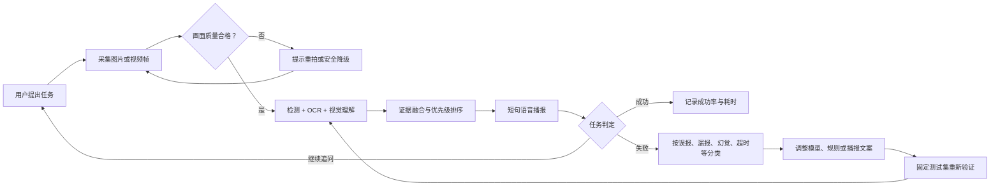
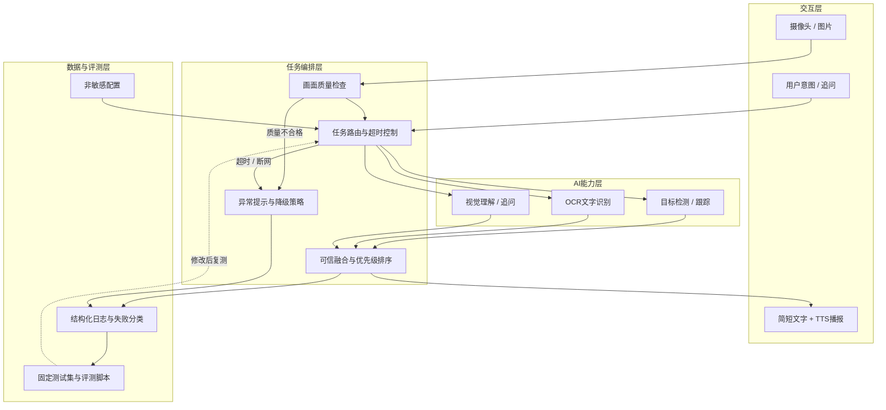

# AI视觉辅助盲人环境理解系统

<div align="center">

**让摄像头看到的环境信息，变成视障用户听得懂、来得及、可核验的语音提示。**

面向计算机设计大赛人工智能应用方向的双人项目

`环境概述` · `场景文字读取` · `物品查找` · `视觉追问` · `语音播报`

</div>

> [!IMPORTANT]
> **当前处于规划与基础验证阶段，尚未形成可使用或可演示的MVP。** 本项目是环境理解辅助工具，不是导航系统；当前代码不得用于道路通行、避障或其他安全决策。

## 目录

- [项目定位](#项目定位)
- [核心闭环](#核心闭环)
- [设计亮点](#设计亮点)
- [系统架构](#系统架构)
- [功能范围](#功能范围)
- [技术路线](#技术路线)
- [评测与证据](#评测与证据)
- [当前进度](#当前进度)
- [快速开始](#快速开始)
- [仓库结构](#仓库结构)
- [安全、隐私与局限](#安全隐私与局限)
- [项目文档](#项目文档)

## 项目定位

视障用户需要的通常不是一段冗长的“图片描述”，而是与当前任务直接相关的信息，例如：

- “前面是什么环境？”
- “门大概在哪个方向？”
- “请读一下这个提示牌。”
- “桌上有没有水杯？”

通用看图问答模型可能回答过长、漏掉关键物体，也可能把不确定内容说成事实。本项目计划让目标检测、OCR和视觉语言模型分别提供证据，再根据**用户意图、信息重要性、模型置信度和内容新颖度**决定播报顺序。

### 一句话方案

> 摄像头或图片输入 → 画面质量检查 → 多模型分析 → 可信融合与信息排序 → 简短语音播报 → 失败复盘与固定测试集重测。

### 首版典型场景

| 场景 | 用户输入示例 | 预期输出示例 |
|---|---|---|
| 环境概述 | “前面是什么？” | “室内走廊，前方有人，右侧有一扇门。” |
| 物品查找 | “帮我找水杯。” | “可能在画面右下方。” |
| 文字读取 | “读一下前面的字。” | 按合理顺序播报高置信度文字。 |
| 视觉追问 | “桌上还有什么？” | 根据当前画面给出简短、可追问的回答。 |

示例仅说明输出形式，不代表系统当前已经实现或达到相应准确率。

## 核心闭环

参考优秀作品“规划—执行—反馈—优化”的表达方式，本项目把一次环境理解任务和后续工程改进放入同一闭环：



闭环的重点不是让模型在使用时自动学习，而是让每次失败都留下可复现记录，并经过修改前后对照验证。

## 设计亮点

以下内容是**计划实现并通过实验验证的设计**，不是已经完成的比赛成果。

| 设计点 | 要解决的问题 | 计划机制 | 验证方法 | 状态 |
|---|---|---|---|---|
| 意图驱动的可信融合 | 单一模型容易漏检或产生幻觉 | 检测、OCR、视觉模型保留各自来源和置信度，按任务相关性、重要性、置信度、新颖度排序 | 单视觉模型 vs 多模型融合 | 方案已定义，待实现 |
| 面向听觉的分层表达 | 长描述会占用注意力，关键内容可能来得太晚 | 先播报与任务最相关的信息，再提供背景；使用短句并支持追问 | 详细播报 vs 简洁播报 | 方案已定义，待实现 |
| 失败可见的安全降级 | 模糊、低光、断网和超时可能产生误导 | 先检查画面质量；低置信时明确说“不确定”；网络失败时回退到可用的本地能力 | 正常、低光、模糊、断网、超时用例 | 方案已定义，待实现 |
| 连续场景的时序去重 | 视频中同一信息可能反复播报 | 使用目标跟踪、时间窗口和信息新颖度抑制重复内容 | 无去重 vs 有去重 | P1计划功能 |

计划中的信息排序可抽象为：

```text
信息得分 = 任务相关性 + 重要性 + 模型置信度 + 内容新颖度 + 位置重要性
```

各项权重不会凭主观固定，将根据基线测试和对照实验调整。

### 与普通单模型看图问答的设计对比

| 维度 | 普通单模型看图问答 | 本项目的计划方案 |
|---|---|---|
| 任务目标 | 通用图片描述和问答 | 聚焦环境概述、读字、找物和追问 |
| 信息来源 | 主要依赖单一视觉模型 | 检测、OCR、视觉模型分别提供证据 |
| 输出方式 | 可能较长，顺序不一定适合听觉 | 按任务优先级生成短句并支持继续追问 |
| 不确定性 | 可能直接生成看似确定的答案 | 保留来源与置信度，低置信时明确提示 |
| 连续画面 | 容易重复描述 | 计划加入时序去重和新颖度判断 |
| 异常处理 | 通常只返回错误或空结果 | 计划覆盖低光、模糊、断网、超时和降级 |
| 可验证性 | 结果难以定位到具体模块 | 分模块记录结果、耗时和失败类型 |

这张表是技术设计比较，不是实测优越性结论。最终差异必须由固定测试集和消融实验支持。

## 系统架构



### 计划中的统一结果格式

各AI模块不直接拼接自然语言，而是先返回结构化结果，便于融合、追踪和测试：

```json
{
  "task": "find_object",
  "items": [
    {
      "label": "cup",
      "source": "detector",
      "confidence": 0.86,
      "position": "right-bottom"
    }
  ],
  "warnings": [],
  "latency_ms": 0
}
```

该格式仍处于设计阶段，字段会在模块示例跑通后冻结。

## 功能范围

### P0：比赛必须完成

| 功能 | 最小交付 | 验收方式 |
|---|---|---|
| 环境概述 | 识别主要场景和关键物体并简短播报 | 10个固定室内场景 |
| 场景文字读取 | 输出文字、位置和置信度并按阅读顺序播报 | 10个清晰/倾斜/反光文字场景 |
| 物品查找 | 返回目标是否出现及画面中的大致方向 | 10个常见物品场景 |
| 视觉追问 | 围绕当前画面回答一个简短问题 | 预设问题集 + 人工核对事实 |
| 质量与异常处理 | 对模糊、低光、断网和超时给出明确提示 | 10个困难场景与故障测试 |
| 语音交互 | 主要操作可通过少量按钮和TTS完成 | 静态任务可独立完成 |
| 日志与评测 | 保存结构化结果、耗时和失败原因，不保存敏感原图 | 可生成测试汇总表 |

### P1：P0稳定后再做

- 连续画面目标跟踪与重复播报抑制。
- 本地能力与云端视觉模型的自动切换。
- Android端摄像头、语音输入和无障碍交互。
- 小规模自有场景数据微调或规则优化。

### P2：本届暂不做

- 户外自主导航、交通灯决策和道路通行判断。
- 单目精确测距和医疗级、工程级安全承诺。
- 人脸身份识别。
- 从零训练大型视觉语言模型。

## 技术路线

项目采用“**预训练模型/合规接口 + 自定义任务编排与融合**”路线：先跑通完整闭环，再根据固定测试结果决定是否微调小模型，不从零训练大型模型。

| 模块 | 当前候选 | 作用 | 选型状态 |
|---|---|---|---|
| 开发语言 | Python 3.11 | 主程序、推理、接口和评测 | 已确定 |
| 图像处理 | OpenCV、NumPy | 摄像头、图像预处理和质量检测 | 待验证 |
| 深度学习环境 | 当前基线为PyTorch | 加载和运行视觉模型 | 最终方案待合规检查 |
| 目标检测 | 轻量预训练检测模型 | 找物、位置和置信度 | 具体模型待基线测试 |
| 中文OCR | PaddleOCR轻量模型候选 | 读取场景文字 | 待验证 |
| 视觉理解 | 合规的视觉语言模型接口或本地预训练模型 | 场景概述、关系理解和追问 | 待选型 |
| 结果融合 | 自定义Python规则 | 来源保留、优先级排序和不确定提示 | 待实现 |
| 后端 | FastAPI候选 | 提供统一分析接口 | 待实现 |
| 语音 | 系统TTS或本地TTS | 播报结果 | 待验证 |
| 前端 | 网页优先，Android为后续方案 | 摄像头、主操作和结果展示 | 待确定 |

> 具体模型、框架、数据集和API在使用前必须核对本届比赛规则、授权范围和第三方许可证。候选名称不代表最终参赛方案。

## 评测与证据

优秀作品不能只展示“能运行”，还需要回答“是否准确、是否更快、是否更稳、改进是否有效”。本项目计划建立40个固定场景，并将调试样本与最终测试样本分开：

- 10个室内环境概述场景。
- 10个场景文字读取场景。
- 10个物品查找场景。
- 10个困难场景：低光、模糊、遮挡、多人或杂乱背景。

### 初始验收指标

| 模块 | 指标 | 初始目标 | 当前结果 |
|---|---|---|---|
| 目标检测 | 核心物品查找成功率 | ≥85% | 尚未测试 |
| OCR | 清晰文字字符准确率 | ≥85% | 尚未测试 |
| 场景概述 | 事实正确率 | ≥85% | 尚未测试 |
| 完整系统 | 固定场景任务成功率 | ≥80% | 尚未测试 |
| 性能 | 完整响应P50 | ≤5秒 | 尚未测试 |
| 去重 | 重复播报率 | 相比无跟踪版本下降≥50% | 尚未测试 |
| 稳定性 | 连续现场演示 | 3次不崩溃 | 尚未测试 |

这些数值是第一版工程目标，不是已有成绩；完成基线测试后可以据实调整。

### 必做对照实验

1. 只使用视觉语言模型 vs 检测、OCR和视觉模型融合。
2. 无优先级排序 vs 有优先级排序。
3. 无时序去重 vs 有时序去重。
4. 详细播报 vs 简洁播报。

### 比赛材料证据链

每个“已完成”结论至少对应一种证据：

- 可复现的源代码和启动步骤。
- 测试表、原始统计数据和计算方法。
- 修改前后对照图或消融实验。
- 典型成功案例与至少3类失败案例。
- 模型、数据、代码库和许可证来源表。
- 用户手册、设计说明、演示视频和现场应急方案。

## 当前进度

| 项目项 | 状态 | 证据/下一步 |
|---|---|---|
| GitHub仓库与双人协作流程 | ✅ 已完成 | 已建立远程仓库和提交规范 |
| Python 3.11独立Conda环境 | ✅ 已完成 | `ai-vision` 环境可用 |
| PyTorch与CUDA验证 | ✅ 已完成 | 当前电脑可调用NVIDIA显卡 |
| 8周计划、分工和评测指标 | ✅ 已完成 | 见 `PROJECT_PLAN.md` |
| 基础目录结构 | 🚧 本地已创建 | 待随本次变更提交Git |
| OpenCV图片读取 | ⏳ 待完成 | 第一个代码里程碑 |
| 检测、OCR、视觉理解、TTS独立示例 | ⏳ 待完成 | 分别记录输入、输出、耗时和错误 |
| 上传图片到语音播报的MVP | ⏳ 待完成 | 端到端连续演示3次 |
| 固定测试集和评测报告 | ⏳ 待完成 | 建立40个合法测试场景 |
| 用户手册、视频和答辩材料 | ⏳ 待完成 | 第6周起集中整理 |

> 当前 `main.py` 仍是初始化示例，不代表项目功能。README中的计划项只有在代码、测试和演示证据齐全后才能改为“已完成”。

## 8周路线图

| 周次 | 技术主线 | 产品、测试与材料主线 | 里程碑 |
|---|---|---|---|
| 第1周 | Git、OpenCV、目标检测基线 | 需求依据、竞品和核心场景 | 功能边界 + 检测演示 |
| 第2周 | OCR、TTS、视觉理解独立示例 | 40个合法样本、界面线框图 | 各模块可单独运行 |
| 第3周 | FastAPI、统一JSON和异常格式 | 测试用例、播报文案 | 图片输入到语音输出 |
| 第4周 | 融合排序、找物和追问 | 第一轮固定测试 | MVP连续演示3次 |
| 第5周 | 跟踪去重、缓存和性能 | 交互界面、静态任务测试 | 连续场景演示 |
| 第6周 | 断网、超时、低光和模糊降级 | 第二轮测试、手册和脚本 | 修改前后对照 |
| 第7周 | 冻结大功能、针对性优化 | 图表、PPT和视频初版 | 完整评测报告 |
| 第8周 | 一键启动、备份和故障演练 | 材料定稿、模拟答辩 | 最终提交包 |

详细任务、负责人和进度维护方式见 [PROJECT_PLAN.md](./PROJECT_PLAN.md)。

## 快速开始

### 当前开发环境

```text
Windows
Python 3.11.15
Conda环境：ai-vision
PyTorch 2.13.0+cu130
NVIDIA RTX 5060 Laptop GPU
```

### 克隆仓库

```bash
git clone https://github.com/fly69783/ai-vision-assistant.git
cd ai-vision-assistant
```

### 创建基础环境

```bash
conda create -n ai-vision python=3.11 -y
conda activate ai-vision
python --version
```

> 项目尚未冻结完整依赖，也暂时没有可用的 `requirements.txt` 和正式启动命令。模型选择完成后再补充准确版本；目前不要根据旧教程批量安装依赖。

## 仓库结构

```text
ai-vision-assistant/
├─ app/                    # FastAPI或主程序入口
├─ core/                   # 检测、OCR、视觉理解、融合和语音模块
├─ frontend/               # 网页或Android客户端
├─ tests/                  # 测试用例、评测脚本；隐私图片不上传
├─ docs/                   # 架构、测试报告、用户手册和比赛材料
├─ scripts/                # 环境检查、数据准备和启动脚本
├─ configs/                # 非敏感配置
├─ PROJECT_PLAN.md         # 进度、8周排期、风险和决策记录
├─ 项目实施与学习大纲.md    # 模块、学习路线、材料和答辩大纲
├─ main.py                 # 当前初始化示例，后续替换
└─ README.md
```

## 双人协作

| 角色 | 主要职责 | 每周必须交付 |
|---|---|---|
| 技术主力 | Python工程、视觉模型、融合、后端、性能、技术答辩 | 可运行版本、截图/日志、性能数据和失败案例 |
| 产品测试主力 | 资料调研、交互、测试集、图表、手册、PPT和视频 | 场景依据、测试表、界面材料和进度汇总 |
| 两人共同 | 需求冻结、每周演示、失败复盘、重大选型和模拟答辩 | 周演示、决策记录和下一周清单 |

### Git协作约定

开始工作前：

```bash
git pull
```

完成一个明确任务后：

```bash
git status
git add <本次修改的文件>
git commit -m "说明本次完成的内容"
git push
```

- `main` 分支只保留能够正常运行或完整说明的版本。
- 一次提交只处理一件事，提交说明要具体。
- API密钥放在 `.env`，不能上传GitHub。
- 不提交虚拟环境、模型权重、未经授权的数据集、运行缓存和隐私图片。

## 安全、隐私与局限

- 本项目不替代盲杖、导盲犬、他人协助或专业无障碍设备。
- 不承诺精确测距、道路避障、交通安全或紧急风险判断。
- 不做人脸身份识别，不采集与任务无关的个人信息。
- 测试图片必须有合法来源；若调用云端API，应先最小化数据并核对隐私条款。
- 日志默认保存结构化结果、耗时和失败原因，不保存不必要的原始画面。
- 当前没有真实视障用户、相关教师或志愿者参与，不会伪造访谈、问卷、签名或用户评价。
- 现阶段需求依据来自公开资料、无障碍规则检查和普通用户的安全静态任务测试；这些结果不能代表真实视障用户体验。

## 项目文档

- [完整项目计划](./PROJECT_PLAN.md)：当前状态、功能优先级、8周任务、分工、指标、风险、决策与进度。
- [实施与学习大纲](./项目实施与学习大纲.md)：用户流程、模块设计、学习路线、替代验证、材料结构与答辩准备。

## 项目说明

本项目目前用于学习和比赛开发，尚未发布稳定版本，也未添加正式开源许可证。第三方模型、代码和数据集将在选型后记录来源、版本、用途和许可证；在此之前，不应把仓库内容视为可直接复用的开源产品。
