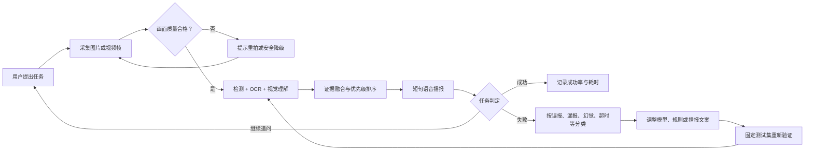
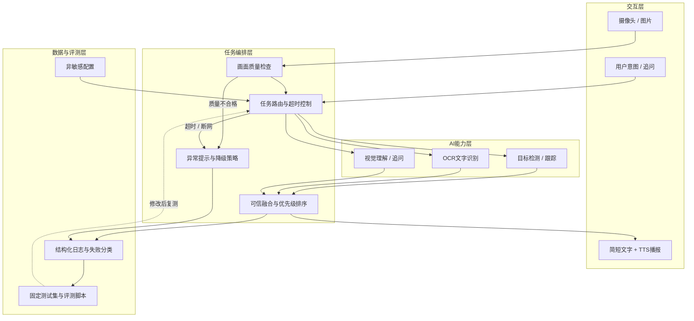

# AI视觉辅助盲人环境理解系统

<div align="center">

**让摄像头看到的环境信息，变成视障用户听得懂、来得及、可核验的语音提示。**

面向计算机设计大赛人工智能应用方向的双人项目

`环境概述` · `场景文字读取` · `物品查找` · `视觉追问` · `语音播报`

</div>

> [!IMPORTANT]
> **当前已接入四项真实AI能力：Torchvision SSDLite本地目标检测、RapidOCR本地文字识别、Qwen3-VL-4B本地视觉理解和智谱GLM-4.5V云端视觉理解。** 视觉后端支持仅本地、仅云端和本地优先降级三种模式。网页/PWA支持手机拍照或相册选图、画面质量检查、多模型结构化结果和语音播报。当前功能已经可以形成比赛MVP技术闭环，但准确率、稳定性和响应时间仍需40个固定场景验证。本项目不是导航系统，不得用于道路通行、避障或其他安全决策。

## 目录

- [项目定位](#项目定位)
- [当前版本一眼看懂](#当前版本一眼看懂)
- [核心闭环](#核心闭环)
- [设计亮点](#设计亮点)
- [系统架构](#系统架构)
- [功能范围](#功能范围)
- [技术路线](#技术路线)
- [评测与证据](#评测与证据)
- [当前进度](#当前进度)
- [快速开始](#快速开始)
- [手机使用与PWA安装](#手机使用与pwa安装)
- [仓库结构](#仓库结构)
- [安全、隐私与局限](#安全隐私与局限)
- [项目文档](#项目文档)

## 当前版本一眼看懂

| 已经可以运行 | 仍然没有实现 |
|---|---|
| 可安装、适配手机的高对比度PWA | 摄像头连续视频与目标跟踪 |
| SSDLite本地目标检测与归一化位置框 | 门、盲道、扶手等自定义类别训练 |
| RapidOCR本地中英文识别与文字框 | 困难文字场景的系统评测和优化 |
| Qwen3-VL本地视觉理解、GLM-4.5V可选云端模式与结构化证据 | 经过固定测试集验证的准确率 |
| 四类任务路由、多模型融合和统一JSON接口 | 本地模型与云端模型的自动切换 |
| 浏览器自带语音播报 | 可供视障用户实际依赖的产品能力 |
| 离线外壳、网络恢复和安全响应策略 | 比赛现场可交付的完整MVP |
| 66项自动化测试和真实模型流程检查 | 原生Android/iOS应用 |

当前版本已经完成“图片→质量检查→检测/OCR/视觉理解→证据融合→语音播报”的真实技术闭环。下一阶段重点不是继续堆功能，而是建立固定场景、统计效果、修复失败案例并形成比赛证据。

## 项目定位

视障用户需要的通常不是一段冗长的“图片描述”，而是与当前任务直接相关的信息，例如：

- “前面是什么环境？”
- “门大概在哪个方向？”
- “请读一下这个提示牌。”
- “桌上有没有水杯？”

通用看图问答模型可能回答过长、漏掉关键物体，也可能把不确定内容说成事实。本项目计划让目标检测、OCR和视觉语言模型分别提供证据，再根据**用户意图、信息重要性、模型置信度和内容新颖度**决定播报顺序。

### 一句话方案

> 摄像头或图片输入 → 画面质量检查 → 多模型分析 → 可信融合与信息排序 → 简短语音播报 → 失败复盘与固定测试集重测。

### 首版典型场景

| 场景 | 用户输入示例 | 预期输出示例 |
|---|---|---|
| 环境概述 | “前面是什么？” | “室内走廊，前方有人，右侧有一扇门。” |
| 物品查找 | “帮我找水杯。” | “可能在画面右下方。” |
| 文字读取 | “读一下前面的字。” | 按合理顺序播报高置信度文字。 |
| 视觉追问 | “桌上还有什么？” | 根据当前画面给出简短、可追问的回答。 |

示例仅说明输出形式，不代表系统当前已经实现或达到相应准确率。

## 核心闭环

参考优秀作品“规划—执行—反馈—优化”的表达方式，本项目把一次环境理解任务和后续工程改进放入同一闭环：



闭环的重点不是让模型在使用时自动学习，而是让每次失败都留下可复现记录，并经过修改前后对照验证。

## 设计亮点

以下内容同时包含已经落地的基础机制和仍需模型、数据验证的比赛设计。状态栏以仓库当前代码为准。

| 设计点 | 要解决的问题 | 计划机制 | 验证方法 | 状态 |
|---|---|---|---|---|
| 意图驱动的可信融合 | 单一模型容易漏检或产生幻觉 | 检测、OCR、视觉模型保留各自来源和置信度，按任务相关性、重要性、置信度、新颖度排序 | 单视觉模型 vs 多模型融合 | 三项真实模型和网页链路已验证，待40个固定场景做消融对照 |
| 面向听觉的分层表达 | 长描述会占用注意力，关键内容可能来得太晚 | 先播报与任务最相关的信息，再提供背景；使用短句并支持追问 | 详细播报 vs 简洁播报 | 短句生成和浏览器播报已实现，待用户测试 |
| 失败可见的安全降级 | 模糊、低光、断网和超时可能产生误导 | 先检查画面质量；低置信时明确说“不确定”；网络失败时回退到可用的本地能力 | 正常、低光、模糊、断网、超时用例 | 图片质量拒绝和未配置提示已实现，其他故障待补充 |
| 连续场景的时序去重 | 视频中同一信息可能反复播报 | 使用目标跟踪、时间窗口和信息新颖度抑制重复内容 | 无去重 vs 有去重 | P1计划功能 |

计划中的信息排序可抽象为：

```text
信息得分 = 任务相关性 + 重要性 + 模型置信度 + 内容新颖度 + 位置重要性
```

各项权重不会凭主观固定，将根据基线测试和对照实验调整。

### 与普通单模型看图问答的设计对比

| 维度 | 普通单模型看图问答 | 本项目的计划方案 |
|---|---|---|
| 任务目标 | 通用图片描述和问答 | 聚焦环境概述、读字、找物和追问 |
| 信息来源 | 主要依赖单一视觉模型 | 检测、OCR、视觉模型分别提供证据 |
| 输出方式 | 可能较长，顺序不一定适合听觉 | 按任务优先级生成短句并支持继续追问 |
| 不确定性 | 可能直接生成看似确定的答案 | 保留来源与置信度，低置信时明确提示 |
| 连续画面 | 容易重复描述 | 计划加入时序去重和新颖度判断 |
| 异常处理 | 通常只返回错误或空结果 | 计划覆盖低光、模糊、断网、超时和降级 |
| 可验证性 | 结果难以定位到具体模块 | 分模块记录结果、耗时和失败类型 |

这张表是技术设计比较，不是实测优越性结论。最终差异必须由固定测试集和消融实验支持。

## 系统架构



### 已实现的统一结果格式

各AI模块不直接拼接自然语言，而是先返回结构化结果，便于融合、追踪和测试。以下示例展示能力未配置时的安全降级响应；启用模型后同一接口会返回真实证据：

```json
{
  "request_id": "自动生成的请求编号",
  "timestamp": "2026-07-16T04:00:00Z",
  "status": "unavailable",
  "task": "read_text",
  "message": "任务所需的AI能力尚未配置。",
  "narration": "暂时无法读取文字，请先配置OCR能力。",
  "quality": {
    "status": "accepted",
    "width": 1280,
    "height": 720,
    "brightness": 126.4,
    "blur_score": 382.1,
    "issues": []
  },
  "evidence": [],
  "warnings": ["OCR尚未启用。"],
  "capabilities": [],
  "latency_ms": 18.6
}
```

完整字段由 `core/domain/models.py` 中的Pydantic模型约束。后续真实模型也必须返回同样的证据结构，避免每接一个模型就改一次前后端。

## 功能范围

### P0：比赛必须完成

| 功能 | 最小交付 | 验收方式 |
|---|---|---|
| 环境概述 | 识别主要场景和关键物体并简短播报 | 10个固定室内场景 |
| 场景文字读取 | 输出文字、位置和置信度并按阅读顺序播报 | 10个清晰/倾斜/反光文字场景 |
| 物品查找 | 返回目标是否出现及画面中的大致方向 | 10个常见物品场景 |
| 视觉追问 | 围绕当前画面回答一个简短问题 | 预设问题集 + 人工核对事实 |
| 质量与异常处理 | 对模糊、低光、断网和超时给出明确提示 | 10个困难场景与故障测试 |
| 语音交互 | 主要操作可通过少量按钮和TTS完成 | 静态任务可独立完成 |
| 日志与评测 | 保存结构化结果、耗时和失败原因，不保存敏感原图 | 可生成测试汇总表 |

### P1：P0稳定后再做

- 连续画面目标跟踪与重复播报抑制。
- 本地能力与云端视觉模型的自动切换。
- 语音输入、语音打断和更完整的手机无障碍兼容。
- 小规模自有场景数据微调或规则优化。

### P2：本届暂不做

- 户外自主导航、交通灯决策和道路通行判断。
- 单目精确测距和医疗级、工程级安全承诺。
- 人脸身份识别。
- 从零训练大型视觉语言模型。

## 技术路线

项目采用“**预训练模型/合规接口 + 自定义任务编排与融合**”路线：先跑通完整闭环，再根据固定测试结果决定是否微调小模型，不从零训练大型模型。

| 模块 | 当前候选 | 作用 | 选型状态 |
|---|---|---|---|
| 开发语言 | Python 3.11 | 主程序、推理、接口和评测 | 已确定 |
| 图像处理 | OpenCV、NumPy | 图片解码、预处理和质量检测 | 基础功能已实现并测试 |
| 深度学习环境 | PyTorch 2.13、Torchvision 0.28 | 本地目标检测和GPU推理 | 已在RTX 5060 CUDA上验证 |
| 目标检测 | SSDLite320 MobileNetV3 COCO权重 | 找物、位置框和置信度 | 已接入，待固定场景评测和类别扩充 |
| 中文OCR | RapidOCR 3.9.1、PP-OCRv6-small、ONNX Runtime | 本地读取中英文场景文字 | 已接入CPU版，待困难文字评测 |
| 视觉理解 | 本地Qwen3-VL-4B Q4_K_M + 智谱GLM-4.5V API | 场景概述、文字读取回退、物品查找和追问 | 两种后端均已接入；本机Qwen已在RTX 5060上验证100% GPU推理 |
| 结果融合 | 自定义Python规则 | 来源保留、优先级排序和不确定提示 | 基础服务已实现并测试 |
| 后端 | FastAPI | 提供健康检查、图片分析和接口文档 | 已实现基础版本 |
| 语音 | 浏览器Web Speech API | 播报分析结果，不增加安装负担 | 已实现基础版本 |
| 前端 | 原生HTML、CSS和JavaScript PWA | 手机拍照/选图、任务选择、结果、语音、网络和安装状态 | 已实现并完成桌面/手机/离线检查 |

> 具体模型、框架、数据集和API在使用前必须核对本届比赛规则、授权范围和第三方许可证。候选名称不代表最终参赛方案。

## 评测与证据

优秀作品不能只展示“能运行”，还需要回答“是否准确、是否更快、是否更稳、改进是否有效”。本项目计划建立40个固定场景，并将调试样本与最终测试样本分开：

- 10个室内环境概述场景。
- 10个场景文字读取场景。
- 10个物品查找场景。
- 10个困难场景：低光、模糊、遮挡、多人或杂乱背景。

40条具体清单和一键检查脚本已经建立。当前没有训练数据，因此先完成[训练前固定场景评测](./docs/testing/fixed-scene-guide.md)，再根据稳定失败类别决定是否微调：

```powershell
python scripts\run_fixed_evaluation.py --check-only
```

### 初始验收指标

| 模块 | 指标 | 初始目标 | 当前结果 |
|---|---|---|---|
| 目标检测 | 核心物品查找成功率 | ≥85% | 尚未测试 |
| OCR | 清晰文字字符准确率 | ≥85% | 尚未测试 |
| 场景概述 | 事实正确率 | ≥85% | 尚未测试 |
| 完整系统 | 固定场景任务成功率 | ≥80% | 尚未测试 |
| 性能 | 完整响应P50 | ≤5秒 | 尚未测试 |
| 去重 | 重复播报率 | 相比无跟踪版本下降≥50% | 尚未测试 |
| 稳定性 | 连续现场演示 | 3次不崩溃 | 尚未测试 |

这些数值是第一版工程目标，不是已有成绩；完成基线测试后可以据实调整。

### 必做对照实验

1. 只使用视觉语言模型 vs 检测、OCR和视觉模型融合。
2. 无优先级排序 vs 有优先级排序。
3. 无时序去重 vs 有时序去重。
4. 详细播报 vs 简洁播报。

### 比赛材料证据链

每个“已完成”结论至少对应一种证据：

- 可复现的源代码和启动步骤。
- 测试表、原始统计数据和计算方法。
- 修改前后对照图或消融实验。
- 典型成功案例与至少3类失败案例。
- 模型、数据、代码库和许可证来源表。
- 用户手册、设计说明、演示视频和现场应急方案。

## 当前进度

| 项目项 | 状态 | 证据/下一步 |
|---|---|---|
| GitHub仓库与双人协作流程 | ✅ 已完成 | 已建立远程仓库和提交规范 |
| Python 3.11独立Conda环境 | ✅ 已完成 | `ai-vision` 环境可用 |
| PyTorch与CUDA验证 | ✅ 已完成 | 当前电脑可调用NVIDIA显卡 |
| 8周计划、分工和评测指标 | ✅ 已完成 | 见 `PROJECT_PLAN.md` |
| 分层目录和配置框架 | ✅ 已完成 | `app/`、`core/`、`frontend/`、`tests/`、`docs/`等职责已拆分 |
| OpenCV图片读取与质量检查 | ✅ 已完成 | 支持格式、大小、分辨率、亮度和模糊度检查 |
| FastAPI与网页/PWA界面 | ✅ 已完成 | 可拍照或选图、查看结果、语音播报、安装到桌面并在断网时打开外壳 |
| 统一数据结构、能力适配器和融合框架 | ✅ 已完成 | Pydantic模型、Provider接口、路由、排序和短句服务可测试 |
| 自动化与浏览器验证 | ✅ 已完成 | 66项测试通过，`app`与`core`覆盖率89%；目标检测、RapidOCR、Qwen3-VL本地项目API和GLM-4.5V真实调用均通过 |
| 检测、OCR、视觉理解、TTS独立示例 | ✅ 已完成 | 三项AI Provider和浏览器TTS均已可运行，下一步测量固定场景效果 |
| 上传图片到语音播报的MVP | 🚧 进行中 | 检测+视觉与OCR+视觉两条真实网页流程已通过，待固定图片连续演示3次并记录结果 |
| 固定测试集和评测报告 | 🚧 进行中 | 40条清单和评测脚本已完成，等待团队拍摄并登记合法图片 |
| 用户手册、视频和答辩材料 | ⏳ 待完成 | 第6周起集中整理 |

> 当前 `main.py` 已是正式开发入口。检测、OCR和视觉理解都按环境变量独立启用；缺少依赖或密钥时会明确显示原因。三项模型接入完成不等于作品完成，固定测试、失败分析、用户手册和现场演示证据仍是下一阶段重点。

## 8周路线图

| 周次 | 技术主线 | 产品、测试与材料主线 | 里程碑 |
|---|---|---|---|
| 第1周 | Git、OpenCV、目标检测基线 | 需求依据、竞品和核心场景 | 功能边界 + 检测演示 |
| 第2周 | OCR、TTS、视觉理解独立示例 | 40个合法样本、界面线框图 | 各模块可单独运行 |
| 第3周 | FastAPI、统一JSON和异常格式 | 测试用例、播报文案 | 图片输入到语音输出 |
| 第4周 | 融合排序、找物和追问 | 第一轮固定测试 | MVP连续演示3次 |
| 第5周 | 跟踪去重、缓存和性能 | 交互界面、静态任务测试 | 连续场景演示 |
| 第6周 | 断网、超时、低光和模糊降级 | 第二轮测试、手册和脚本 | 修改前后对照 |
| 第7周 | 冻结大功能、针对性优化 | 图表、PPT和视频初版 | 完整评测报告 |
| 第8周 | 一键启动、备份和故障演练 | 材料定稿、模拟答辩 | 最终提交包 |

详细任务、负责人和进度维护方式见 [PROJECT_PLAN.md](./PROJECT_PLAN.md)。

## 快速开始

### 当前开发环境

```text
Windows
Python 3.11.15
Conda环境：ai-vision
PyTorch 2.13.0+cu130
Torchvision 0.28.0+cu130
RapidOCR 3.9.1 + ONNX Runtime 1.27.0
NVIDIA RTX 5060 Laptop GPU
```

### 克隆仓库

```bash
git clone https://github.com/fly69783/ai-vision-assistant.git
cd ai-vision-assistant
```

### 创建并安装环境

```bash
conda create -n ai-vision python=3.11 -y
conda activate ai-vision
python -m pip install --upgrade pip
python -m pip install -r requirements-dev.txt
```

只运行项目、不做测试时，也可以安装更精简的运行依赖：

```bash
python -m pip install -r requirements.txt
```

### 安装并启用本地目标检测与OCR

先按照PyTorch官网选择器安装与你显卡匹配的Torch和Torchvision，然后在项目根目录运行：

```powershell
powershell -ExecutionPolicy Bypass -File scripts/install_local_ai.ps1 -Enable
```

脚本会安装RapidOCR和ONNX Runtime、缓存SSDLite与PP-OCRv6模型并保存两个能力开关。完成后关闭并重新打开终端。由于RapidOCR声明依赖`opencv-python`，而本项目使用共享同一`cv2`命名空间的`opencv-python-headless`，请使用本脚本安装，不要手工同时安装两个OpenCV发行包。

### 安装本地Qwen3-VL视觉模型

```powershell
powershell -ExecutionPolicy Bypass -File scripts/install_local_vlm.ps1 -Enable
```

脚本会安装或复用Ollama，下载约3.3GB的`qwen3-vl:4b-instruct-q4_K_M`，并把项目保存为“仅本地视觉”模式。模型在本机RTX 5060 Laptop 8GB显存上已完成真实图片验证，Ollama报告为100% GPU推理。第一次调用需要加载模型，会明显慢于后续调用。

使用结束后可立即释放显存，不会删除模型文件：

```powershell
powershell -ExecutionPolicy Bypass -File scripts/stop_local_vlm.ps1
```

可用模式由`AI_VISION_VISION_BACKEND`控制：`ollama`只用本地且不上传图片，`zhipu`只用云端，`hybrid`本地失败时允许把图片发送给云端GLM降级。比赛演示建议默认使用`ollama`，确有联网降级需求且已确认隐私与费用时再选择`hybrid`。

### 配置视觉API

密钥只能放在本机环境变量或部署平台的密钥管理中，不能写入代码、YAML、截图或提交到GitHub。Windows可在新开的Anaconda Prompt中临时配置：

```bat
set AI_VISION_VISION_ENABLED=true
set AI_VISION_ZHIPU_API_KEY=你的新密钥
```

如需长期保存，可在Windows“编辑账户的环境变量”中创建同名变量。修改长期环境变量后必须关闭并重新打开终端。自动化测试会强制禁用真实API，不会产生调用费用。

### 检查环境并启动

```powershell
python scripts/check_environment.py
powershell -ExecutionPolicy Bypass -File scripts/run_dev.ps1
```

也可以直接启动：

```bash
python -m uvicorn app.main:app --reload
```

启动后打开：

- 测试页面：<http://127.0.0.1:8000/>
- API文档：<http://127.0.0.1:8000/api/v1/docs>
- 健康检查：<http://127.0.0.1:8000/api/v1/health>

### 运行质量检查

```powershell
powershell -ExecutionPolicy Bypass -File scripts/run_tests.ps1
```

脚本会依次运行代码规范检查、自动化测试和覆盖率统计。

## 手机使用与PWA安装

当前网页已经是PWA：支持手机后置摄像头拍照、从相册选图、安装到主屏幕和离线打开应用外壳。分析本身仍需要后端在线；Service Worker只缓存HTML、CSS、JavaScript、Manifest和图标，**不会缓存API响应、用户图片或分析结果**。

- 本机开发：访问 `http://127.0.0.1:8000/` 即可测试页面和PWA外壳。
- 手机联调：手机和电脑处于同一局域网，后端监听局域网地址，并通过HTTPS访问；除`localhost`外，浏览器通常要求HTTPS才能使用摄像头和安装PWA。
- 安装：支持时页眉会出现“安装应用”；也可使用浏览器菜单中的“安装应用/添加到主屏幕”。
- 更新：新Service Worker准备好后页眉会出现“更新网页”，点击后自动切换版本并刷新。
- 离线：页面会明确提示分析服务不可达，不会显示旧结果冒充新分析。
- 公网联调：临时隧道地址本身不提供项目级登录和限额保护。启用计费API时不要公开转发地址，测试结束后关闭隧道窗口。

详细步骤见[前端说明](./frontend/README.md)和[开发入门](./docs/development/getting-started.md)。

## 仓库结构

```text
ai-vision-assistant/
├─ app/
│  ├─ api/routes/          # 健康检查和图片分析接口
│  ├─ middleware/          # 请求ID、缓存策略和安全响应头
│  ├─ dependencies.py      # 配置、服务等依赖组装
│  └─ main.py              # FastAPI应用工厂和网页挂载
├─ core/
│  ├─ config/              # YAML与环境变量配置
│  ├─ domain/              # 任务、状态、证据等统一数据结构
│  ├─ providers/           # 检测、OCR、视觉模型适配器接口
│  ├─ services/            # 质量检查、编排、融合和短句生成
│  └─ observability/       # 日志基础设施
├─ frontend/web/           # 无障碍优先的PWA页面、Manifest、Service Worker和图标
├─ tests/
│  ├─ unit/                # 配置、质量、融合和编排单元测试
│  ├─ integration/         # API集成测试
│  └─ fixtures/            # 测试样本说明；隐私图片不上传
├─ docs/
│  ├─ architecture/        # 系统架构
│  ├─ development/         # 开发与扩展指南
│  ├─ testing/             # 测试方法和用例模板
│  └─ competition/         # 比赛交付检查清单
├─ scripts/                # 环境检查、启动和测试脚本
├─ configs/                # 可提交的非敏感配置
├─ .github/workflows/      # GitHub Actions持续集成
├─ main.py                 # 本地开发启动入口
├─ requirements*.txt       # 运行依赖和开发依赖
├─ pyproject.toml          # Python、测试和代码规范配置
├─ PROJECT_PLAN.md         # 计划、分工、学习、验收、材料和进度的唯一记录
└─ README.md
```

## 双人协作

| 角色 | 主要职责 | 每周必须交付 |
|---|---|---|
| 技术主力 | Python工程、视觉模型、融合、后端、性能、技术答辩 | 可运行版本、截图/日志、性能数据和失败案例 |
| 产品测试主力 | 资料调研、交互、测试集、图表、手册、PPT和视频 | 场景依据、测试表、界面材料和进度汇总 |
| 两人共同 | 需求冻结、每周演示、失败复盘、重大选型和模拟答辩 | 周演示、决策记录和下一周清单 |

### Git协作约定

开始工作前：

```bash
git pull
```

完成一个明确任务后：

```bash
git status
git add <本次修改的文件>
git commit -m "说明本次完成的内容"
git push
```

- `main` 分支只保留能够正常运行或完整说明的版本。
- 一次提交只处理一件事，提交说明要具体。
- API密钥放在 `.env`，不能上传GitHub。
- 不提交虚拟环境、模型权重、未经授权的数据集、运行缓存和隐私图片。

## 安全、隐私与局限

- 本项目不替代盲杖、导盲犬、他人协助或专业无障碍设备。
- 不承诺精确测距、道路避障、交通安全或紧急风险判断。
- 不做人脸身份识别，不采集与任务无关的个人信息。
- 测试图片必须有合法来源；若调用云端API，应先最小化数据并核对隐私条款。
- 日志默认保存结构化结果、耗时和失败原因，不保存不必要的原始画面。
- 当前没有真实视障用户、相关教师或志愿者参与，不会伪造访谈、问卷、签名或用户评价。
- 现阶段需求依据来自公开资料、无障碍规则检查和普通用户的安全静态任务测试；这些结果不能代表真实视障用户体验。

## 项目文档

- [完整项目计划](./PROJECT_PLAN.md)：当前状态、用户流程、技术要点、学习路线、8周任务、分工、验收、材料、答辩、风险、决策与进度。
- [文档导航](./docs/README.md)：架构、开发、测试和比赛材料的入口。
- [系统架构说明](./docs/architecture/overview.md)：代码分层、一次请求的流转过程和扩展原则。
- [新手启动指南](./docs/development/getting-started.md)：从创建环境到打开测试页面的完整步骤。
- [接入真实模型](./docs/development/adding-a-provider.md)：如何实现检测、OCR或视觉理解适配器。
- [测试说明](./docs/testing/README.md)：自动测试、固定场景和证据保存方法。
- [比赛交付清单](./docs/competition/delivery-checklist.md)：源码、文档、视频、答辩和许可证核对项。

## 项目说明

本项目目前用于学习和比赛开发，尚未发布稳定版本，也未添加正式开源许可证。仓库现有代码是可运行的工程基础框架，不代表模型效果或真实视障用户体验。第三方模型、代码和数据集将在选型后记录来源、版本、用途和许可证；在此之前，不应把仓库内容视为可直接复用的无障碍产品。
