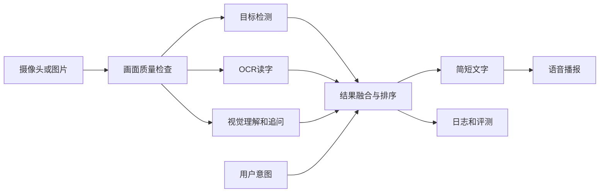

# AI视觉辅助盲人环境理解系统

一个面向计算机设计大赛人工智能应用方向的双人项目。系统计划通过摄像头或图片识别环境中的关键物体和文字，根据用户当前任务筛选重要信息，并使用简短语音播报结果。

> **当前状态：项目规划与基础验证阶段。** 仓库已经完成开发环境和项目计划配置，但尚未形成可使用或可演示的MVP，请不要把当前代码用于真实导航或安全决策。

## 项目目标

首版聚焦四类任务：

- 环境概述：简要说明场景和主要物体。
- 文字读取：识别门牌、提示牌、包装和菜单等文字。
- 物品查找：回答门、椅子、水杯等物品的大致方向。
- 视觉追问：根据当前图片回答简短问题。

系统将加入语音播报、信息排序、低置信度提示，以及低光、模糊、断网和超时处理。

## 安全声明

- 本项目是环境理解辅助工具，不是独立导航系统。
- 不替代盲杖、导盲犬、他人协助或专业无障碍设备。
- 不承诺精确测距、道路避障或交通安全判断。
- 不做人脸身份识别，不应上传或保存不必要的敏感图片。
- 当前尚未完成真实视障用户参与式验证。

## 计划架构



## 初步技术栈

| 模块 | 计划使用 |
|---|---|
| 开发语言 | Python 3.11 |
| 图像处理 | OpenCV、NumPy |
| 深度学习 | PyTorch |
| 目标检测 | 轻量YOLO |
| 中文OCR | PaddleOCR轻量模型 |
| 场景理解 | 视觉语言模型 |
| 后端接口 | FastAPI |
| 语音播报 | 系统TTS或本地TTS |
| 前端 | 网页或Android，待第1周确定 |

具体模型和版本将在独立示例验证后冻结，避免过早加入不必要的依赖。

## 当前进度

| 项目项 | 状态 |
|---|---|
| GitHub仓库与双人协作流程 | 已完成 |
| Python 3.11独立Conda环境 | 已完成 |
| PyTorch与CUDA验证 | 已完成 |
| 完整项目计划与8周排期 | 已完成 |
| OpenCV图片读取 | 待完成 |
| 目标检测、OCR、视觉问答、TTS独立示例 | 待完成 |
| MVP完整流程 | 待完成 |
| 固定测试集和评测报告 | 待完成 |
| 用户手册、视频和答辩材料 | 待完成 |

## 文档

- [完整项目计划](./PROJECT_PLAN.md)：目标、进度、8周任务、分工、风险、决策和测试指标。
- [实施与学习大纲](./项目实施与学习大纲.md)：模块设计、学习路线、材料结构和答辩准备。

## 本地环境

当前主力开发环境：

```text
Windows
Python 3.11.15
Conda环境：ai-vision
PyTorch 2.13.0+cu130
NVIDIA RTX 5060 Laptop GPU
```

克隆项目：

```bash
git clone https://github.com/fly69783/ai-vision-assistant.git
cd ai-vision-assistant
```

创建基础环境：

```bash
conda create -n ai-vision python=3.11 -y
conda activate ai-vision
python --version
```

> 项目尚未冻结完整依赖，也暂时没有可用的 `requirements.txt`。模型选择完成后会补充准确的安装和运行命令；目前不要根据旧教程批量安装依赖。

## 计划中的仓库结构

```text
ai-vision-assistant/
├─ app/                    # FastAPI或主程序
├─ core/                   # 检测、OCR、视觉理解、融合和语音模块
├─ frontend/               # 网页或Android客户端
├─ tests/                  # 固定图片、测试用例和评测脚本
├─ docs/                   # 设计说明、用户手册和测试报告
├─ scripts/                # 环境检查和启动脚本
├─ configs/                # 非敏感配置
├─ PROJECT_PLAN.md         # 完整项目计划和进度
├─ 项目实施与学习大纲.md    # 详细实施、学习和答辩大纲
└─ README.md
```

## 双人分工

- 技术主力：Python工程、视觉模型、结果融合、后端、性能和技术答辩。
- 产品测试主力：资料调研、交互流程、测试集、数据图表、用户手册、PPT和视频。
- 两人共同：每周演示、失败复盘、重大技术选择和模拟答辩。

## Git协作约定

开始工作前：

```bash
git pull
```

完成一个明确任务后：

```bash
git status
git add <本次修改的文件>
git commit -m "说明本次完成的内容"
git push
```

- `main` 分支只保留能够正常运行或完整说明的版本。
- 一次提交只处理一件事，提交说明要具体。
- API密钥放在 `.env`，不能上传GitHub。
- 不提交虚拟环境、模型权重、数据集、运行结果和隐私图片。

## 评测计划

计划建立40个固定测试场景：

- 10个室内环境概述。
- 10个文字读取。
- 10个物品查找。
- 10个困难场景，包括低光、模糊、遮挡和杂乱背景。

主要记录任务成功率、误报、漏报、响应时间、重复播报率和失败原因。所有结论应有测试表、截图或数据支持。

## 项目说明

本项目目前用于学习和比赛开发，尚未发布稳定版本，也没有添加正式开源许可证。第三方模型、代码和数据集将在选型后记录来源与许可证。
