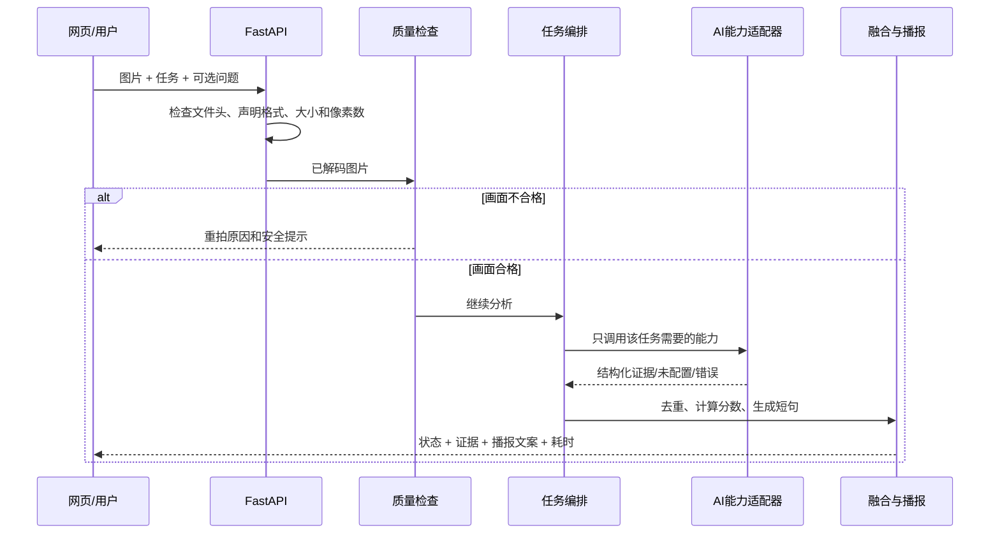

# 系统架构说明

## 为什么要分层

这个项目会同时涉及网页、接口、图像处理、多个AI模型、语音和测试。如果全部写进一个`main.py`，后面更换模型或定位错误会非常困难。因此基础框架按职责分层。

| 层 | 目录 | 用最简单的话解释 |
|---|---|---|
| 交互层 | `frontend/web/` | 负责手机拍照/选图、任务选择、结果、语音和PWA安装。 |
| 接口层 | `app/` | 接收网页上传的图片，把结果返回给网页。 |
| 响应策略 | `app/middleware/` | 生成请求ID，控制缓存，并添加基础安全响应头。 |
| 领域层 | `core/domain/` | 规定“任务、证据、质量、响应”长什么样。 |
| 服务层 | `core/services/` | 决定先做什么、调用谁、怎样排序、怎样播报。 |
| 能力层 | `core/providers/` | 真正调用检测、OCR或视觉模型，可随时替换。 |
| 配置与日志 | `core/config/`、`core/observability/` | 管理阈值、端口和日志格式，不存密钥和原图。 |

## 一次请求怎样流转

## 为什么默认能力都是“未配置”

基础框架先证明接口、错误处理和测试方法可以运行。真实模型尚未选定时，`UnavailableProvider`只返回未配置状态，不会随机生成检测框或文字。这可以防止团队在演示和材料中误把占位结果当成真实AI结果。

## PWA怎样处理缓存和隐私

网页使用Manifest和Service Worker提供主屏安装、静态外壳离线打开和版本更新。缓存白名单只包含页面、样式、脚本、Manifest和图标；所有`/api/`请求都跳过Service Worker。因此用户图片、分析响应和旧结果不会进入浏览器应用缓存。离线时页面只提供明确状态和使用说明，不能假装已经完成分析。

后端为API响应设置`Cache-Control: no-store`，并为每次请求提供`X-Request-ID`，便于定位现场错误。网页响应使用内容安全策略等基础响应头；Swagger文档没有套用会破坏外部资源的网页专用CSP。

## 接入模型时不能破坏的约定

1. 每条证据必须标明来源和置信度。
2. 适配器报错时不能让整个服务器崩溃。
3. 不把原始图片写进普通日志。
4. 低置信度信息必须保留不确定表达。
5. 真实模型加入后必须新增对应测试和许可证登记。
6. 不得让Service Worker缓存API、原图或分析结果。
7. 新增上传格式时必须同步修改配置、文件头识别、前端校验和测试。
