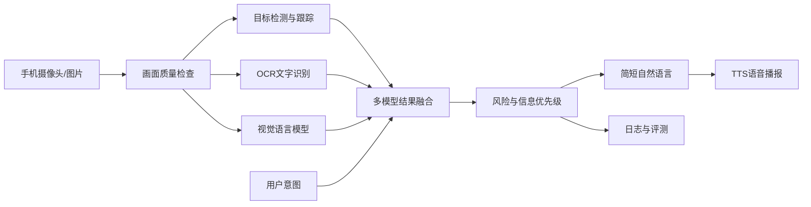

# AI视觉辅助盲人环境理解系统

## 双人参赛实施与学习大纲（8周基准版）

> 如果实际只剩4周：合并第1-2周、3-4周、5-6周，砍掉所有P2功能；如果超过8周，再增加模型微调和移动端优化。

## 一、作品定位

### 1. 一句话介绍
用户通过手机摄像头拍摄周围环境，系统识别关键物体和文字，结合用户问题筛选最有行动价值的信息，并用简短语音播报。

### 2. 要解决的问题
- 传统图像描述往往冗长，用户难以及时获得关键内容。
- 单一视觉模型可能漏检或产生幻觉。
- 连续视频容易重复播报同一物体，造成信息干扰。
- 网络或模型失败时，普通AI应用缺少安全降级。

### 3. 边界声明
- 作品是“环境理解辅助”，不是独立导航系统。
- 不替代盲杖、导盲犬、他人协助或专业无障碍设备。
- 不做人脸身份识别，不保存陌生人人脸。
- 单目视觉不给出未经验证的精确距离。

## 二、功能范围

### P0：比赛必须完成
1. 场景概述：一句话说清地点类型、主要对象和通道情况。
2. 文字读取：识别门牌、提示牌、包装、菜单等场景文字。
3. 物品查找：回答“门/水杯/椅子在哪里”。
4. 视觉追问：针对当前画面回答一个简短问题。
5. 语音播报：所有关键结果可朗读、重播和停止。
6. 信息排序：危险/行动相关内容优先，限制播报长度。
7. 错误处理：模糊、过暗、遮挡、超时和断网有明确提示。
8. 测试记录：每次推理保存模块耗时、结果来源和置信度，不保存敏感原图。

### P1：完成P0后再做
1. 摄像头连续取帧。
2. 目标跟踪与重复播报抑制。
3. 语音提问和语音打断。
4. 本地检测/OCR与云端视觉模型的自动切换。
5. 用户可选择“简洁/详细”播报模式。

### P2：本届比赛暂不做
1. 全自动室内导航和路线规划。
2. 精确测距、避障承诺和道路安全决策。
3. SLAM、三维地图、智能眼镜硬件。
4. 人脸身份识别和情绪识别。
5. 从零训练大型视觉语言模型。

## 三、典型用户流程

### 流程A：环境概述
用户按一次主按钮 → 系统检查画面质量 → 检测主要物体和文字 → 生成不超过3句的概述 → 语音播报。

### 流程B：寻找物品
用户说“门在哪里” → 系统只关注门相关检测 → 输出“右前方有一扇门” → 若不确定则提示重新取景。

### 流程C：读取文字
用户说“读一下前面的字” → OCR检测文字区域 → 按从上到下、从左到右排序 → 只播报高置信文本。

### 流程D：连续观察
系统低频采样视频帧 → 跟踪已播报物体 → 只有重要变化或用户追问时再次播报。

## 四、系统架构



## 五、模块设计

### 1. 输入与质量检查
- OpenCV读取图片或摄像头帧。
- 计算亮度、清晰度和分辨率。
- 过暗提示“环境较暗，请打开灯或靠近目标”。
- 模糊提示“画面不清晰，请稳定手机重新拍摄”。

### 2. 目标检测与跟踪
- 使用轻量YOLO模型建立基线。
- 第一阶段只识别常见类别：人、椅子、桌子、门、杯子、车辆等。
- 视频模式加入跟踪ID，减少同一物体反复播报。
- 如比赛后期发现门、台阶等关键类别识别不足，再制作小型自定义数据集微调。

### 3. OCR
- 使用PaddleOCR轻量模型识别中文场景文字。
- 输出文字、位置和置信度。
- 过滤低置信字符，合并同一行文字。
- 首版使用CPU推理，减少与PyTorch CUDA依赖冲突。

### 4. 视觉语言模型
- 用于场景概述、关系理解和开放式追问。
- 输入提示要求结构化JSON，而不是直接生成自由长文。
- 输出字段建议：`scene`、`important_objects`、`warnings`、`answer`、`uncertainty`。
- 不允许视觉语言模型独自决定高风险障碍信息。

### 5. 可信融合与创新算法
- 每条信息保留来源：检测器、OCR或视觉语言模型。
- 初步优先级公式：

```text
priority = 0.30×风险 + 0.25×用户相关性 + 0.20×新颖度
         + 0.15×置信度 + 0.10×位置重要性
```

- 先输出可能影响行动的信息，再输出用户主动询问的信息，最后输出环境补充。
- 低置信结果使用“不确定”“可能”等表达，不伪装成确定事实。

### 6. 语言与语音
- 结果最多3句，每句尽量少于25字。
- 支持停止、重复、切换简洁/详细模式。
- Android端使用系统TextToSpeech；电脑原型可先使用本地TTS。

### 7. 前后端
- 第一版：Python + FastAPI提供 `/analyze`、`/ocr`、`/ask` 接口。
- 第一版界面可用网页或Python简易界面，先证明闭环。
- 第二版：Android Kotlin + CameraX上传压缩图片，接收结构化结果并TTS播报。

## 六、双人分工

### 成员A：你——技术主力

主要负责：
- Python工程结构、Conda依赖和Git主分支。
- OpenCV图像输入和质量检测。
- PyTorch、YOLO检测与跟踪。
- OCR、视觉语言模型接入。
- 多模型融合、优先级算法和FastAPI后端。
- 性能测试、GPU部署和现场技术答辩。

每周必须交付：
- 可运行代码。
- 一段测试视频或截图。
- 本周准确性/延迟记录。
- 至少3个失败案例及处理结论。

### 成员B：队友——产品、交互、测试与材料主力

主要负责：
- 权威资料调研、竞品分析和需求依据整理。
- 低保真界面、操作流程和语音文案。
- 采集并整理测试图片/视频，建立场景清单。
- 编写用户手册、设计说明、演示脚本和答辩PPT。
- 负责Android/网页界面；如果编程基础弱，先做测试页面和接口调用。
- 组织普通同学完成静态任务测试，记录问题、完成测试表和图表；不得写成视障用户试用。

每周必须交付：
- 更新后的需求/测试表。
- 10个以上规范命名的测试样本。
- 一页文档或一版界面。
- 资料依据、测试反馈与修改前后对照。

### 两人共同承担
- 每周一次代码和功能演示。
- 两人都能讲清输入、模型、输出、失败场景和安全边界。
- 重大技术选型共同确认并记录原因。
- 最后两周互换演示角色，防止现场单点故障。

## 七、你需要学习的内容

### 第一级：立即掌握（边做边学）
1. Python：函数、类、文件、异常、JSON、日志。
2. Git：clone、add、commit、push、pull、branch、merge。
3. NumPy与OpenCV：图像数组、颜色空间、缩放、摄像头、清晰度/亮度。
4. PyTorch推理：Tensor、device、`model.eval()`、`no_grad()`、GPU耗时。
5. 目标检测：框、类别、置信度、IoU、mAP、误报和漏报。
6. HTTP/FastAPI：请求、图片上传、JSON返回、超时和异常。

完成标准：能够独立写出“上传图片→模型推理→JSON结果”的程序。

### 第二级：项目中期掌握
1. YOLO推理、验证、跟踪和小数据集微调。
2. OCR检测/识别流程、字符准确率和文字行排序。
3. 视觉语言模型提示词、结构化输出和幻觉控制。
4. 多线程/异步基础、模型缓存和性能测量。
5. 测试集划分、消融实验和错误分析。

完成标准：能解释每个模块为何存在、何时失败、怎样测量。

### 第三级：有余力再学
1. 模型量化、ONNX/TensorRT导出。
2. 单目深度估计及其误差边界。
3. Android Kotlin、CameraX和网络请求。
4. 自定义数据标注和模型微调。

### 暂时不用深挖
- 从零推导所有神经网络数学公式。
- 自己实现卷积框架。
- 大规模分布式训练。
- RNN机器翻译等与项目无关章节。

## 八、队友需要学习的内容

### 必学
1. 视障用户类型、使用场景和访谈伦理。
2. 无障碍交互：语音优先、单一主操作、可打断、可重复、错误可恢复。
3. Figma或同类原型工具。
4. 基础GitHub：Issue、README、上传测试记录、提交文档。
5. 测试方法：任务、输入、期望、实际、是否通过、失败原因。
6. 基础数据分析：Excel统计成功率、平均延迟并制作图表。

### 建议掌握
1. Python基础和API调用。
2. HTML/CSS/JavaScript或Android基础，二选一。
3. 演示视频剪辑和PPT表达。

完成标准：能够独立组织一轮测试，并用数据说明系统哪里变好了。

## 九、8周里程碑

| 周次 | 技术主力任务 | 队友任务 | 验收物 |
|---|---|---|---|
| 第1周 | 摄像头/图片读取、Git结构、检测Demo | 权威资料、竞品和用户流程 | 需求依据表+检测演示 |
| 第2周 | OCR、TTS、视觉模型独立Demo | 30个场景样本、界面线框图 | 5个模块均可单独运行 |
| 第3周 | FastAPI与统一JSON数据结构 | 测试用例、前端原型 | 上传图片后可播报结果 |
| 第4周 | 融合排序、找物和追问 | 第一轮完整测试 | MVP连续演示3次 |
| 第5周 | 跟踪去重、性能与缓存 | Android/网页交互、用户手册初稿 | 视频流或连续拍摄可用 |
| 第6周 | 异常处理、离线降级 | 第一轮规则检查和静态任务测试、材料初稿 | 断网/模糊/低光可恢复 |
| 第7周 | 模型微调或针对性优化 | 第二轮替代测试、数据图表 | 完整评测报告 |
| 第8周 | 冻结代码、一键启动、备份 | 视频、PPT、手册定稿 | 完整提交包和模拟答辩 |

## 十、未来7天具体行动

### 第1天
- 你：建立Git仓库结构，运行OpenCV读取图片。
- 队友：整理5份权威资料，列出20个使用场景和每个场景的资料依据。

### 第2天
- 你：运行轻量YOLO图片检测，保存框、类别和置信度。
- 队友：整理竞品功能，画出“一键拍摄→语音播报”流程。

### 第3天
- 你：运行OCR，测试门牌、菜单、包装各5张。
- 队友：建立测试表，记录OCR正确与错误字符。

### 第4天
- 你：实现TTS，能朗读检测和OCR结果。
- 队友：写简洁播报规范和20条示例文案。

### 第5天
- 你：做场景概述/视觉问答Demo，要求JSON输出。
- 队友：设计4种模式的低保真界面。

### 第6天
- 两人：把检测、OCR、概述结果合并成一个统一JSON。
- 两人：用10张图片进行第一次端到端测试。

### 第7天
- 两人：演示、复盘失败案例、冻结下一周任务。
- 输出：1分钟演示视频、测试表、README第一版。

## 十一、仓库结构

```text
ai-vision-assistant/
├─ app/                  # FastAPI或主程序
├─ core/
│  ├─ detector.py       # 目标检测/跟踪
│  ├─ ocr.py            # OCR
│  ├─ vision_qa.py      # 场景理解和追问
│  ├─ fusion.py         # 结果融合与排序
│  └─ speech.py         # 语音输出
├─ frontend/             # 网页或Android客户端
├─ tests/
│  ├─ images/
│  ├─ cases.csv
│  └─ benchmark.py
├─ docs/                 # 方案、手册、访谈和评测
├─ scripts/              # 启动和环境检查
├─ configs/
├─ requirements.txt
├─ README.md
└─ LICENSES.md           # 模型、数据和第三方许可证
```

## 十二、Git协作规则
- `main`只放可演示版本。
- 每个任务建短分支：`feature/ocr`、`feature/ui`、`docs/manual`。
- 每次提交只做一件事，提交信息说明结果。
- 使用Issue记录任务、负责人、截止日期和验收标准。
- API Key放 `.env`，原图、密钥、模型大文件和用户隐私不提交Git。
- 每周打一个演示标签，如 `demo-week-2`。

## 十三、测试与量化指标

### 固定测试集
- 10个室内概述场景。
- 10个文字读取场景。
- 10个物品查找场景。
- 10个困难场景：低光、模糊、遮挡、多人和杂乱背景。
- 测试集与调试样本分开，防止只优化已见图片。

### 指标
| 模块 | 指标 | 初始目标（可根据基线调整） |
|---|---|---|
| 目标检测 | 找物任务成功率、误报率、漏报率 | 核心类别成功率≥85% |
| OCR | 字符准确率、完整读取率 | 清晰文字≥85% |
| 场景概述 | 事实正确率、关键事实覆盖率 | 事实正确率≥85% |
| 融合系统 | 端到端任务成功率 | 固定场景≥80% |
| 性能 | P50/P95响应时间 | 完整响应P50≤5秒 |
| 去重 | 重复播报率 | 比无跟踪基线下降≥50% |
| 用户体验 | 完成任务率、满意度、干扰反馈 | 第二轮优于第一轮 |

### 必做对照实验
1. 只用视觉语言模型 vs 多模型融合。
2. 无优先级排序 vs 有优先级排序。
3. 无时序去重 vs 有时序去重。
4. 详细播报 vs 简洁播报。

## 十四、无法访谈真实视障用户时的验证方案

### 1. 先说清楚事实
- 本阶段没有真实视障用户、相关教师或志愿者参与。
- 不编造访谈记录、签名、照片、问卷结果或用户好评。
- 设计说明书中明确写出限制，不能把普通同学称为视障用户。

### 2. 用四类证据代替
1. 权威资料：整理不少于5份无障碍资料，每条设计要求注明来源。
2. 竞品公开反馈：查看同类产品公开介绍和评论，将问题分为“太慢、太啰嗦、识别错误、操作复杂、隐私担忧”等类别。
3. 固定场景测试：对室内概述、读字、找物和困难画面进行量化测试。
4. 普通同学静态任务测试：请3—5名同学坐着完成“拍照、听播报、停止、重播、找物”等任务，只检查操作和表达是否容易理解。

### 3. 安全要求
- 不做蒙眼行走、上下楼梯、过马路或避障实验。
- 不使用普通同学的结果证明真实视障体验。
- 不保存参与者人脸、声音等不必要的个人信息。

### 4. 替代测试记录
- 测试者编号，不记录无关身份信息。
- 测试任务、设备和环境。
- 是否完成、耗时、听错次数、是否需要帮助。
- 最难理解的一句话和最难操作的一步。
- 修改前后结果对照。

### 5. 报告中的标准表述
> 受项目周期和招募条件限制，本阶段尚未完成真实视障用户参与式研究。当前需求主要依据权威公开资料，交互部分通过无障碍规则检查和普通用户静态任务测试发现明显问题。上述结果不能代表真实视障用户体验，后续需与目标用户继续验证。

## 十五、提交材料大纲

### 设计说明书
1. 项目背景与问题定义。
2. 用户调研与需求分析。
3. 应用场景和设计理念。
4. 总体架构与模块设计。
5. 核心算法和创新点。
6. 数据、模型和第三方工具来源。
7. 系统实现与界面。
8. 评测方案、实验数据和失败案例。
9. 无障碍、隐私和安全边界。
10. 局限与未来计划。

### 用户手册
1. 安装与启动。
2. 四种模式操作。
3. 语音与按键说明。
4. 网络和权限要求。
5. 常见错误处理。
6. 安全警告与隐私说明。

### 演示视频（3-5分钟）
1. 20秒：真实痛点和作品定位。
2. 40秒：系统架构和创新点。
3. 2分钟：四项核心功能现场实录。
4. 40秒：量化评测和用户反馈。
5. 20秒：安全边界和总结。

### 现场演示顺序
1. 固定图片演示，确保开场稳定。
2. 手机现场拍摄环境概述。
3. 读取现场文字。
4. 查找指定物体并追问。
5. 展示模糊/断网时的降级提示。
6. 展示评测面板或测试报告。

## 十六、答辩分工

### 你负责
- 技术架构、模型、融合算法、GPU部署和性能。
- 现场运行系统并处理异常。

### 队友负责
- 用户需求、交互设计、测试结果、社会价值和材料。
- 操作手机端或担任现场用户。

### 两人都要会回答
- 为什么不只用一个多模态大模型？
- 如何降低幻觉和错误信息风险？
- 创新点是模型还是系统方法？
- 数据从哪里来，是否有隐私和授权？
- 为什么这些测试指标合理？
- 视障用户是否真正参与？
- 断网、低光、遮挡时怎么办？
- 使用了哪些非自主AI工具，如何按规则披露？

对“视障用户是否真正参与”的诚实回答：
> 目前没有。我们没有伪造访谈，而是用权威资料、固定测试集、无障碍规则检查和普通用户静态任务测试降低明显问题。我们在报告中明确了这一局限，真实目标用户验证是下一阶段工作。

## 十七、规则与合规检查
- 从本校或赛区取得最终版竞赛通知和评分表。
- 核对允许使用的非自主AI工具清单。
- 报名表如实填写AI工具、模型、生成内容和技术路径。
- 记录每个模型权重、数据集、代码库和许可证。
- 获得用户测试同意，不公开包含身份信息的原始素材。
- 演示中明确辅助性质，避免高风险功能宣传。

## 十八、每周例会模板（30分钟）
1. 本周能运行什么？现场演示，不只口头描述。
2. 哪3个测试失败最严重？
3. 用户或测试数据告诉了我们什么？
4. 下周只保留哪3个最高优先级任务？
5. 是否影响提交材料、规则合规或现场稳定性？

## 十九、双人两个月通俗版清单（不含具体代码修改）

### 你需要学什么
1. Python和终端：看得懂程序怎么启动、报错在哪里、包装到了哪个环境。
2. Git和GitHub：会下载、保存一次修改、同步队友内容和处理简单冲突。
3. 图像AI基本概念：知道目标检测是“找东西”，OCR是“读字”，视觉大模型是“看图回答”，TTS是“把文字念出来”。
4. 模型会犯什么错：理解误报、漏报、不确定、响应时间，不把模型结果当绝对事实。
5. 系统如何连接：明白图片如何进入系统、各模块输出什么、最后如何变成语音。
6. 测试方法：会算成功率、平均时间，会把失败图片按原因分类。
7. 隐私和安全：知道哪些图片不能保存，为什么不能宣传替代盲杖或独立导航。
8. 答辩表达：能用三分钟讲清问题、方案、创新、测试结果和局限。

### 队友需要学什么
1. 视障需求常识：从可靠资料了解全盲和低视力并不相同，不能凭想象设计。
2. 测试表：会写“要做什么、输入是什么、预期结果、实际结果、是否通过、为什么失败”。
3. 交互流程：会画出用户从打开系统到听到结果的每一步，并尽量减少按钮和长句。
4. GitHub基础：会查看任务、上传文档、更新README，不误传隐私材料。
5. Excel图表：会统计成功率、响应时间和失败类型，制作简单柱状图或饼图。
6. 材料制作：会写用户手册、设计说明，制作PPT和剪辑演示视频。
7. 比赛规则：会核对提交格式、截止日期、AI工具披露和第三方模型许可证。

### 8周安排

| 周次 | 你重点学习 | 队友重点学习 | 两人除写代码外必须做的事 | 本周留下的证据 |
|---|---|---|---|---|
| 第1周 | Git、终端、四种AI模块分别做什么 | 视障需求常识、查可靠资料 | 从5份以上资料整理需求；只选室内概述、读字、找物3个主场景；写清不做导航和精确测距 | 需求依据表、功能边界、任务分工 |
| 第2周 | 看懂检测框、置信度、OCR结果和响应时间 | 画操作流程和低保真界面 | 收集并整理40张可合法使用的测试图片；记录来源；给图片按场景命名 | 样本清单、界面草图、资料来源表 |
| 第3周 | 明白各模块输入输出和错误信息 | 学会写测试用例和简短语音文案 | 制作完整测试表；为每个功能写正常、模糊、过暗、遮挡、断网用例；确定验收标准 | 测试表、播报文案规范、验收标准 |
| 第4周 | 学成功率、误报、漏报、平均时间 | 学Excel统计和画图 | 用固定图片完成第一次完整测试；每个失败都截图并分类；选出最严重的10个问题 | 第一版测试报告、失败案例库、数据图 |
| 第5周 | 学安全降级和“不确定时怎么说” | 学无障碍规则、隐私清单 | 请3—5名普通同学坐着完成静态操作任务；不蒙眼走路；记录是否会操作、是否听懂 | 静态任务记录、隐私清单、局限说明 |
| 第6周 | 学性能记录和现场故障处理 | 写用户手册、演示脚本初稿 | 完成第二轮固定测试，对比前后结果；检查模糊、低光、断网时是否有清楚提示 | 前后对照表、用户手册初稿、演示脚本 |
| 第7周 | 练技术架构和创新点讲解 | 学PPT、视频剪辑和材料排版 | 停止增加新功能；整理来源和许可证；制作测试图表；录制3—5分钟演示视频 | 设计说明初稿、PPT、视频初版、许可证表 |
| 第8周 | 练现场启动、备份和故障回答 | 练需求、价值、测试和局限回答 | 连续演示至少3次；做3轮模拟答辩；准备离线视频、安装包、模型和文档双备份；逐项检查提交要求 | 最终提交包、答辩问题库、应急清单 |

### 每周固定动作
1. 周一只确定3件最重要的事。
2. 周中用固定测试图片检查一次，不靠感觉判断好坏。
3. 周末录一段1分钟演示，记录3个最大失败。
4. 所有资料注明来源，所有测试保留表格和截图。
5. 每人都要能讲清另一人的工作，避免答辩时只会自己的一小块。
